<div align="center">

# APIKey V6 — Customer Management System

### Professional License Management & Authentication Framework

[](https://github.com/pp7803/APIKey)
[](https://www.apple.com/ios)
[](LICENSE)
[](https://theos.dev)

[English](#english-version) • [Tiếng Việt](#phiên-bản-tiếng-việt)

</div>

---

## English Version

## Table of Contents

- [Overview](#overview)
- [What's New in 6.0](#whats-new-in-60)
- [Features](#features)
- [Requirements](#requirements)
- [Installation](#installation)
- [Configuration](#configuration)
- [API Reference](#api-reference)
- [C Bridge API](#c-bridge-api)
- [Usage Examples](#usage-examples)
- [Library Variants](#library-variants)
- [Anti-Hex App](#anti-hex-app)
- [Themes](#themes)
- [Support](#support)

---

## Overview

APIKey 6.0 is a major rewrite of the customer management and license authentication system for iOS jailbreak tweaks. Version 6.0 introduces a clean separation between the tweak entry point and the core library, communicating exclusively through `PPAPIKey.h`. It also adds a C bridge layer, allowing integration from pure C/C++ code without any Objective-C dependency.

### Key Benefits

- **Clean Architecture** — Tweak and core library are fully decoupled; all communication goes through the public header
- **C Bridge** — New C-compatible API for integration from non-Objective-C codebases
- **Secure Authentication** — Industry-standard encryption and validation
- **Device Tracking** — UDID-based device identification
- **Easy Integration** — Simple API with minimal setup
- **Multi-language** — Built-in English and Vietnamese support
- **Independent Toast** — Built-in toast notifications without external dependencies

---

## What's New in 6.0

| 5.7 API            | 6.0 API                                   | Notes                                      |
| ------------------ | ----------------------------------------- | ------------------------------------------ |
| `sharedInstance`   | `shared`                                  | Shorter, cleaner singleton                 |
| `setPackageToken:` | `setToken:`                               | Simplified naming                          |
| `setENLanguage:`   | `setEN:`                                  | Simplified naming                          |
| `setAppVersion:`   | `setVer:`                                 | Simplified naming                          |
| `getKey`           | `getDeviceKey`                            | More explicit naming                       |
| `getUDID`          | `getDeviceID`                             | More explicit naming                       |
| —                  | **C Bridge** (`setTokenC`, `loadingC`, …) | New: call from pure C/C++                  |
| —                  | **Tweak Separation**                      | tweak.mm is independent from core          |
| —                  | **Dual Library**                          | `basic` (all users) and `full` (VIP3 only) |

**Removed from 6.0:** `showCSAL:`, `getDeviceName`, `getiOSVersion`, `getAppVersion`, `getAppName`, `getJailbreakStatus` — these are now handled at the tweak level or removed to keep the core lean.

---

## Features

- **License Key Management** — Create, validate, and revoke access keys
- **Device Information** — Retrieve device key, UDID, bundle ID, and license metadata
- **Expiration Control** — Time-based license management
- **Clipboard Integration** — Easy key copying functionality
- **C Bridge Layer** — Call core functions from C/C++ without Objective-C
- **Dual Library Variants** — `basic` (lightweight, all users) and `full` (all features, VIP3 only)
- **Decoupled Architecture** — Tweak entry point separated from core; communication only through public header

---

## Requirements

| Component        | Version           |
| ---------------- | ----------------- |
| **Platform**     | iOS 14.0+         |
| **Architecture** | arm64             |
| **Build System** | Theos             |
| **C++ Standard** | gnu++17           |
| **Language**     | Objective-C / C++ |

---

## Installation

### 1. Install Theos

Follow the official Theos installation guide for your platform:

```bash
# macOS
brew install theos

# Or visit: https://theos.dev/docs/installation
```

### 2. Download APIKey 6.0

Download the latest release from the [Release section](https://github.com/pp7803/APIKey/releases):

```
PPAPIKey.h
libPPAPIKey_full.a      # Full-featured library (VIP3 required)
libPPAPIKey_basic.a     # Lightweight variant (all users)
```

### 3. Account Registration

Create your developer account and obtain your package token:

🔗 **[Register at APIKey Portal](https://new.ppapikey.xyz)**

---

## Configuration

### Project Setup

Add APIKey to your Theos project's `Makefile`:

```makefile
ARCHS = arm64
TARGET = iphone:clang:latest:14.0

TWEAK_NAME = YourTweak

$(TWEAK_NAME)_FRAMEWORKS = UIKit AVFoundation Foundation SystemConfiguration SafariServices AudioToolbox Accelerate

# Link APIKey library (choose one)
# $(TWEAK_NAME)_LDFLAGS += libPPAPIKey_full.a    # Full-featured (VIP3 required)
$(TWEAK_NAME)_LDFLAGS += libPPAPIKey_basic.a  # Lightweight (all users)

$(TWEAK_NAME)_CCFLAGS = -std=gnu++17 -Wno-deprecated-declarations -Wno-unused-variable
$(TWEAK_NAME)_FILES = tweak.mm

include $(THEOS_MAKE_PATH)/tweak.mk
```

---

## API Reference

### PPAPIKey Interface (Objective-C)

```objective-c
#import <Foundation/Foundation.h>

@interface PPAPIKey : NSObject

#pragma mark - Singleton
+ (instancetype)shared;

#pragma mark - Configuration
/**
 * Sets the package authentication token
 * @param token Your unique package token from APIKey portal
 */
- (void)setToken:(NSString *)token;

/**
 * Enables/disables English language mode
 * @param enable YES for English, NO for Vietnamese
 */
- (void)setEN:(BOOL)enable;

/**
 * Sets the application version
 * @param ver Version string (e.g., "1.0")
 */
- (void)setVer:(NSString *)ver;

#pragma mark - Core
/**
 * Initializes APIKey and executes completion block on success
 * @param execute Completion block called after successful initialization
 */
- (void)loading:(void (^)(void))execute;

/**
 * Packages device data for server submission
 * @param completion Block receiving the packaged data
 */
- (void)packageData:(void (^)(id data))completion;

#pragma mark - Information Retrieval
- (NSString *)getDeviceKey;      // Current license key
- (NSString *)getKeyExpire;      // Key expiration date
- (NSString *)getKeyAmount;      // Remaining key quota
- (NSString *)getDeviceID;       // Device UDID
- (NSString *)getAppBundle;      // Bundle identifier

#pragma mark - Key Management
- (void)exitKey;                 // Remove current license key
- (void)copyKey;                 // Copy license key to clipboard

@end
```

---

## C Bridge API

APIKey 6.0 exposes a pure C bridge, allowing integration from C/C++ code without importing Objective-C headers:

```c
// Set the package authentication token
extern void setTokenC(const char *token);

// Enable/disable English language mode (1 = English, 0 = Vietnamese)
extern void setENC(int enable);

// Set the application version
extern void setVerC(const char *ver);

// Initialize and execute completion block on success
extern void loadingC(void (^execute)(void));

// Package device data for server submission
extern void packageData(void (^completion)(id data));
```

> **Note:** `loadingC` and `packageData` use blocks, which require Objective-C block support (`-fblocks`). For pure C environments, use the Objective-C wrapper.

---

## Usage Examples

### Basic Implementation (Objective-C)

```objective-c
#import "YourTweak.h"
#import "PPAPIKey.h"

%hook YourClass

- (void)viewDidLoad {
    %orig;

    PPAPIKey *api = [PPAPIKey shared];

    [api setToken:@"your_package_token_here"];
    [api setVer:@"1.0"];
    [api setEN:YES];

    [api loading:^{
        NSLog(@"[APIKey] Initialized successfully");
        // Your code here — menu loading, feature activation, etc.
    }];
}

%end
```

### Basic Implementation (C Bridge)

```objective-c
// In your tweak.mm — no need to import PPAPIKey.h

extern "C" void setTokenC(const char *token);
extern "C" void setENC(int enable);
extern "C" void setVerC(const char *ver);
extern "C" void loadingC(void (^execute)(void));

static void run_api(void)
{
    setTokenC("your_package_token_here");
    setENC(0);       // 0 = Vietnamese
    setVerC("1.0");

    loadingC(^{
        NSLog(@"[APIKey] Initialized successfully");
    });
}
```

### Retrieve Device Information

```objective-c
PPAPIKey *api = [PPAPIKey shared];

NSString *key    = [api getDeviceKey];
NSString *expire = [api getKeyExpire];
NSString *amount = [api getKeyAmount];
NSString *udid   = [api getDeviceID];
NSString *bundle = [api getAppBundle];

NSLog(@"Key: %@, Expires: %@, Quota: %@", key, expire, amount);
NSLog(@"Device: %@, Bundle: %@", udid, bundle);
```

### Key Management

```objective-c
PPAPIKey *api = [PPAPIKey shared];

// Copy key to clipboard
[api copyKey];

// Remove key (logout)
[api exitKey];
```

### Full Tweak Template (tweak.mm)

```objective-c
#import <Foundation/Foundation.h>
#import <UIKit/UIKit.h>
#include <CoreFoundation/CoreFoundation.h>

#import "PPAPIKey.h"

extern "C" void setTokenC(const char *token);
extern "C" void setENC(int enable);
extern "C" void setVerC(const char *ver);
extern "C" void loadingC(void (^execute)(void));

// ---- Launch detection via CFNotificationCenter ----
static void launch_callback(CFNotificationCenterRef __unused c,
                            void *__unused o,
                            CFStringRef __unused n,
                            const void *__unused obj,
                            CFDictionaryRef __unused ui)
{
    dispatch_async(dispatch_get_main_queue(), ^{
        setTokenC("your_package_token_here");
        setENC(0);
        setVerC("1.0");
        loadingC(^{
            NSLog(@"[APIKey] Ready");
        });
    });
}

__attribute__((constructor))
static void tweak_init(void)
{
    CFNotificationCenterAddObserver(
        CFNotificationCenterGetLocalCenter(),
        NULL,
        launch_callback,
        (CFStringRef)UIApplicationDidFinishLaunchingNotification,
        NULL,
        CFNotificationSuspensionBehaviorDeliverImmediately
    );
}
```

---

## Library Variants

| Variant   | File                  | Description                                                                                        |
| --------- | --------------------- | -------------------------------------------------------------------------------------------------- |
| **Full**  | `libPPAPIKey_full.a`  | Anti-Hex Protected — protects dylib at generation + protects during key validation. **VIP3 only.** |
| **Basic** | `libPPAPIKey_basic.a` | Protects during key validation only. Lighter, available to all users.                              |

---

## Anti-Hex App

We provide a dedicated Anti-Hex application available on 3 platforms (macOS, Windows, iOS) to help you secure your tweak:

### Download

- [PPAPIKey Hash Generator (zip)](https://ppapikey.xyz/PPAPIkeyHashGenerator.zip) — includes `PPAPIKey Hash Generator.dmg`, `PPAPIKey Hash Generator.ipa`, `PPHashGenerator.Windows-win-x64.zip`

<div align="center">

|            macOS             |              Windows               |            iOS             |
| :--------------------------: | :--------------------------------: | :------------------------: |
| 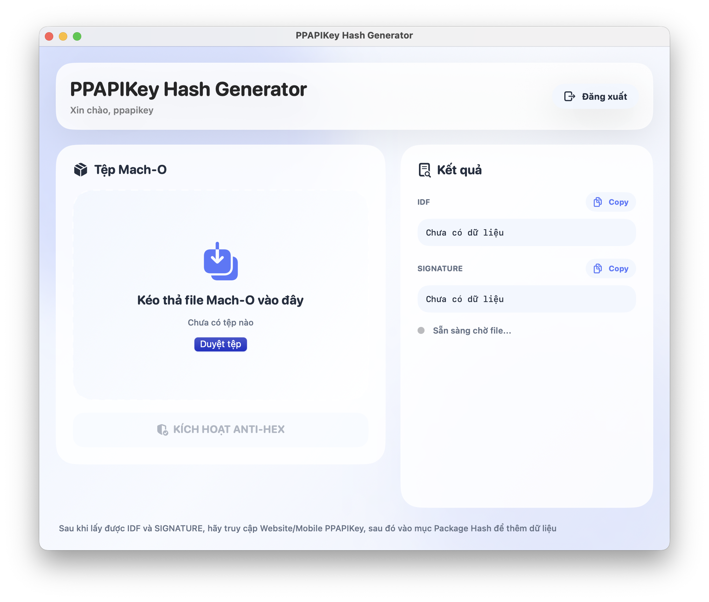 | 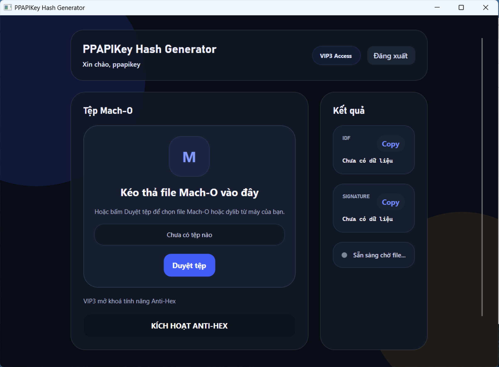 | 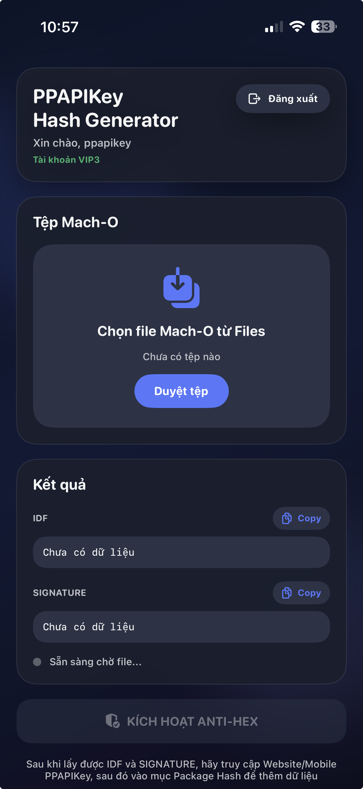 |

</div>

### Workflow

- **VIP3 User:** Can input the `Dylib` into the Tool, then execute **Anti-Hex Full**.
- **VIP2 User (and below):** Can copy the **IDF** and **Signature** from the Tool, then access `Dashboard -> Package Hash` and add the Hash to execute **Anti-Hex Semi**.

---

## Themes

APIKey 6.0 **Full** includes 12 professional themes to customize your UI:

<div align="center">

|                                          |                          |                                      |
| :--------------------------------------: | :----------------------: | :----------------------------------: |
|               **ANDROID**                |         **CST**          |              **GLASS**               |
|     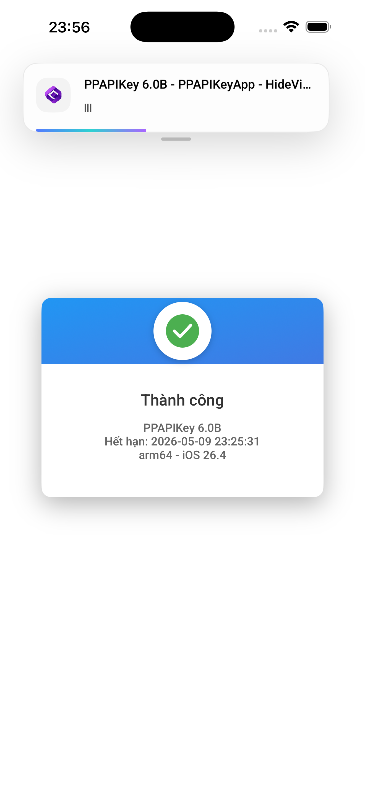     | 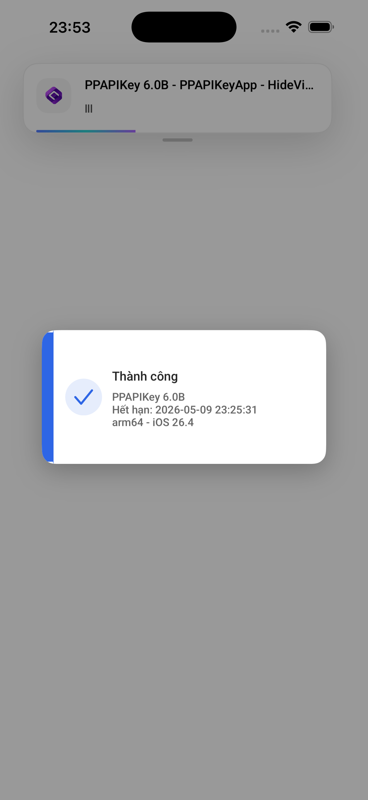 |     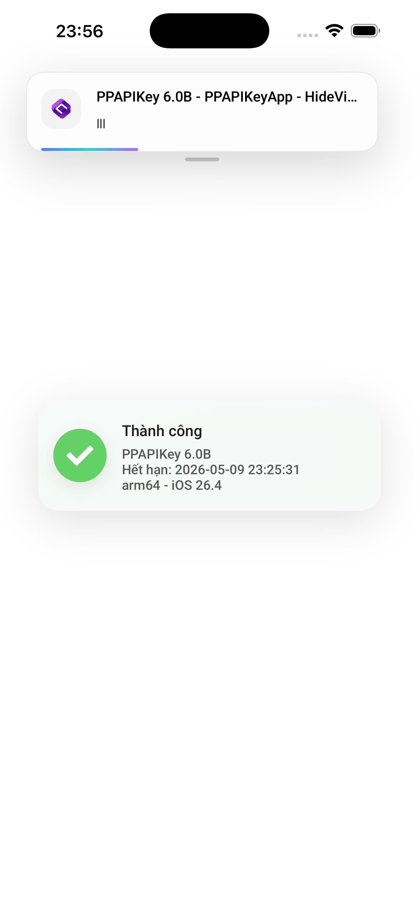     |
|                **HACKER**                |          **JG**          |              **LINUX**               |
|      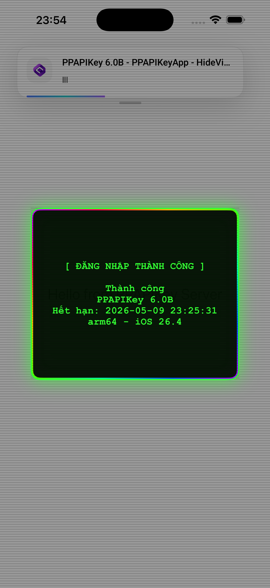      |  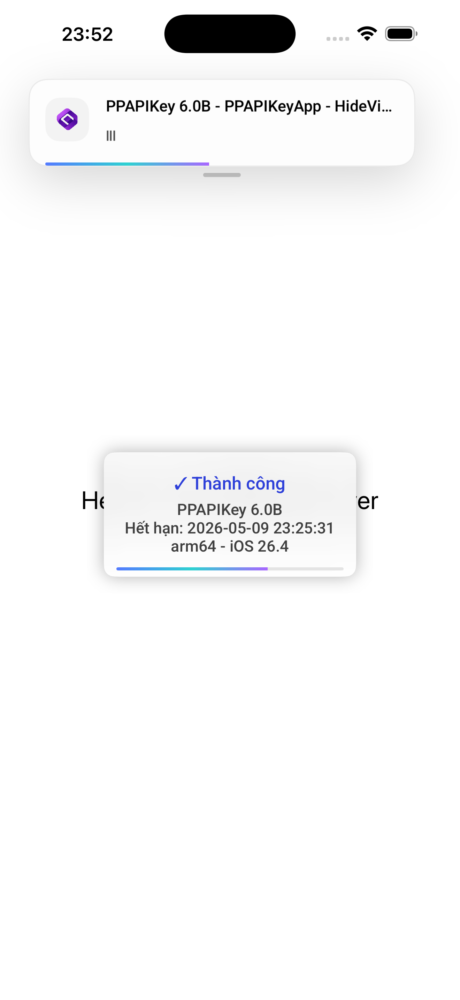  |     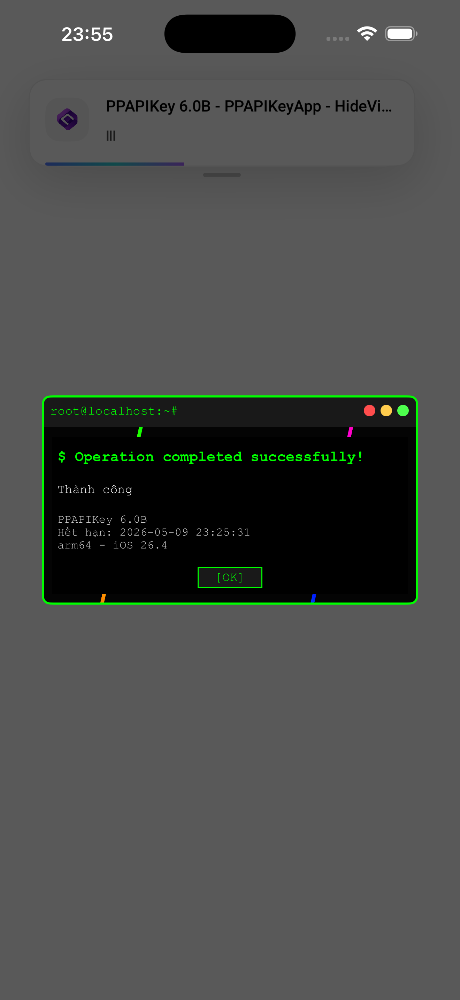     |
|                 **MAC**                  |         **MBP**          |            **MINECRAFT**             |
|         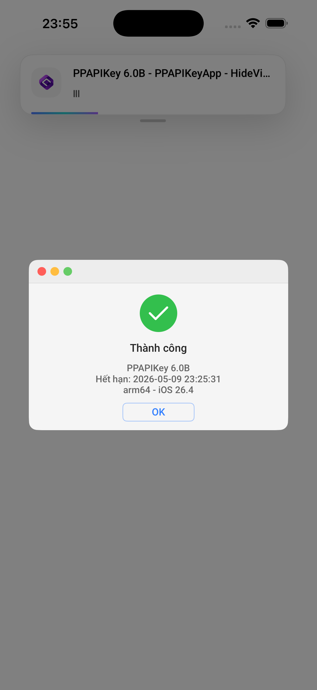         | 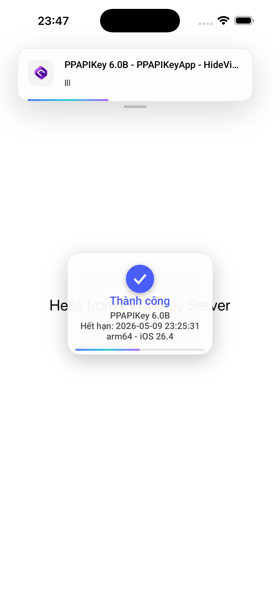 | 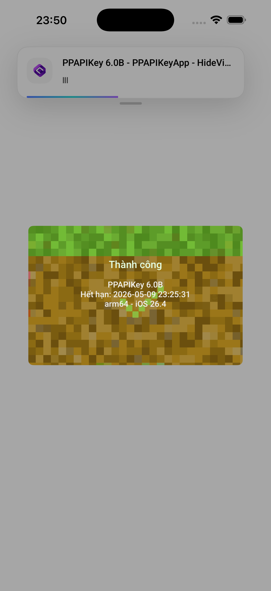 |
|             **NEWYEAR2026**              |         **SCL**          |                **XP**                |
| 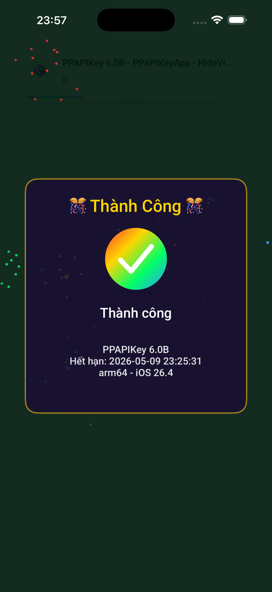 | 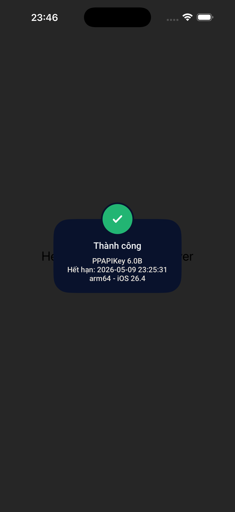 |        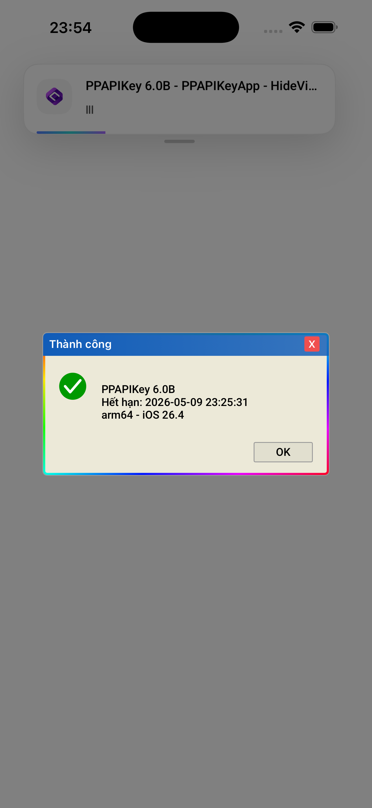        |

</div>

---

## Support

### Contact

- **Telegram**: [@pdp7803](https://t.me/pdp7803)
- **Email**: support@ppapikey.xyz

---

## License & Copyright

```
Copyright © 2024-2026 Phat Pham (@pdp7803)
```

### Important Notes

**Security**: Never commit your package token to version control
**Updates**: Keep APIKey updated for latest security patches
**Compatibility**: Test on target iOS versions before release

---

## Changelog

### v6.0.0

- Complete architecture rewrite: tweak and core are fully decoupled
- New C Bridge API for C/C++ integration (`setTokenC`, `setENC`, `setVerC`, `loadingC`, `packageData`)
- Simplified naming: `shared`, `setToken:`, `setEN:`, `setVer:`
- Renamed getters: `getDeviceKey`, `getDeviceID`
- Dual library: `basic` (lightweight) and `full` (all features)
- Independent toast notification system
- Minimum iOS target raised to 14.0
- Built with gnu++17 standard

---

## Phiên Bản Tiếng Việt

## Mục Lục

- [Tổng Quan](#tổng-quan-vi)
- [Tính Năng Mới Trong 6.0](#tính-năng-mới-trong-60)
- [Tính Năng](#tính-năng-vi)
- [Yêu Cầu Hệ Thống](#yêu-cầu-hệ-thống-vi)
- [Cài Đặt](#cài-đặt-vi)
- [Cấu Hình](#cấu-hình-vi)
- [Tài Liệu API](#tài-liệu-api-vi)
- [C Bridge API](#c-bridge-api-vi)
- [Ví Dụ Sử Dụng](#ví-dụ-sử-dụng-vi)
- [Biến Thể Thư Viện](#biến-thể-thư-viện)
- [Ứng Dụng Anti-Hex](#ứng-dụng-anti-hex)
- [Chủ Đề](#chủ-đề-vi)
- [Hỗ Trợ](#hỗ-trợ-vi)

---

## <a name="tổng-quan-vi"></a>Tổng Quan

APIKey 6.0 là bản viết lại toàn diện của hệ thống quản lý khách hàng và xác thực giấy phép dành cho tweak iOS jailbreak. Phiên bản 6.0 tách biệt hoàn toàn tweak entry point và thư viện lõi, chỉ giao tiếp qua `PPAPIKey.h`. Đồng thời bổ sung C Bridge layer, cho phép tích hợp từ code C/C++ thuần mà không phụ thuộc Objective-C.

### Lợi Ích Chính

- **Kiến Trúc Sạch** — Tweak và thư viện lõi được tách biệt hoàn toàn; mọi giao tiếp qua public header
- **C Bridge** — API tương thích C mới cho phép tích hợp từ codebase không dùng Objective-C
- **Xác Thực Bảo Mật** — Mã hóa và xác thực theo tiêu chuẩn công nghiệp
- **Theo Dõi Thiết Bị** — Nhận diện thiết bị dựa trên UDID
- **Tích Hợp Dễ Dàng** — API đơn giản với thiết lập tối thiểu
- **Đa Ngôn Ngữ** — Hỗ trợ sẵn tiếng Anh và tiếng Việt
- **Toast Độc Lập** — Toast notification tích hợp sẵn, không phụ thuộc bên ngoài

---

## <a name="tính-năng-mới-trong-60"></a>Tính Năng Mới Trong 6.0

| API 5.7            | API 6.0                                   | Ghi Chú                                       |
| ------------------ | ----------------------------------------- | --------------------------------------------- |
| `sharedInstance`   | `shared`                                  | Singleton ngắn gọn hơn                        |
| `setPackageToken:` | `setToken:`                               | Đơn giản hóa tên gọi                          |
| `setENLanguage:`   | `setEN:`                                  | Đơn giản hóa tên gọi                          |
| `setAppVersion:`   | `setVer:`                                 | Đơn giản hóa tên gọi                          |
| `getKey`           | `getDeviceKey`                            | Tên gọi rõ ràng hơn                           |
| `getUDID`          | `getDeviceID`                             | Tên gọi rõ ràng hơn                           |
| —                  | **C Bridge** (`setTokenC`, `loadingC`, …) | Mới: gọi từ C/C++ thuần                       |
| —                  | **Tách Biệt Tweak**                       | tweak.mm độc lập với core                     |
| —                  | **Thư Viện Kép**                          | `basic` (mọi người dùng) và `full` (chỉ VIP3) |

**Đã loại bỏ khỏi 6.0:** `showCSAL:`, `getDeviceName`, `getiOSVersion`, `getAppVersion`, `getAppName`, `getJailbreakStatus` — các phương thức này được xử lý ở tầng tweak hoặc loại bỏ để giữ core tinh gọn.

---

## <a name="tính-năng-vi"></a>Tính Năng

- **Quản Lý License Key** — Tạo, xác thực và thu hồi key truy cập
- **Thông Tin Thiết Bị** — Lấy device key, UDID, bundle ID và metadata giấy phép
- **Kiểm Soát Hết Hạn** — Quản lý giấy phép theo thời gian
- **Tích Hợp Clipboard** — Sao chép key dễ dàng
- **C Bridge Layer** — Gọi hàm lõi từ C/C++ không cần Objective-C
- **Thư Viện Kép** — `basic` (nhẹ, mọi người dùng) và `full` (đầy đủ tính năng, chỉ VIP3)
- **Kiến Trúc Tách Biệt** — Tweak entry point độc lập với core; chỉ giao tiếp qua public header

---

## <a name="yêu-cầu-hệ-thống-vi"></a>Yêu Cầu Hệ Thống

| Thành Phần       | Phiên Bản         |
| ---------------- | ----------------- |
| **Nền Tảng**     | iOS 14.0+         |
| **Kiến Trúc**    | arm64             |
| **Build System** | Theos             |
| **Chuẩn C++**    | gnu++17           |
| **Ngôn Ngữ**     | Objective-C / C++ |

---

## <a name="cài-đặt-vi"></a>Cài Đặt

### 1. Cài Đặt Theos

Làm theo hướng dẫn cài đặt Theos chính thức cho nền tảng của bạn:

```bash
# macOS
brew install theos

# Hoặc truy cập: https://theos.dev/docs/installation
```

### 2. Tải APIKey 6.0

Tải phiên bản mới nhất từ [mục Release](https://github.com/pp7803/APIKey/releases):

```
PPAPIKey.h
libPPAPIKey_full.a      # Thư viện đầy đủ (yêu cầu VIP3)
libPPAPIKey_basic.a     # Phiên bản nhẹ (mọi người dùng)
```

### 3. Đăng Ký Tài Khoản

Tạo tài khoản nhà phát triển và lấy package token:

🔗 **[Đăng ký tại APIKey Portal](https://new.ppapikey.xyz)**

---

## <a name="cấu-hình-vi"></a>Cấu Hình

### Thiết Lập Dự Án

Thêm APIKey vào `Makefile` của dự án Theos:

```makefile
ARCHS = arm64
TARGET = iphone:clang:latest:14.0

TWEAK_NAME = YourTweak

$(TWEAK_NAME)_FRAMEWORKS = UIKit AVFoundation Foundation SystemConfiguration SafariServices AudioToolbox Accelerate

# Liên kết thư viện APIKey (chọn một)
# $(TWEAK_NAME)_LDFLAGS += libPPAPIKey_full.a    # Đầy đủ (yêu cầu VIP3)
$(TWEAK_NAME)_LDFLAGS += libPPAPIKey_basic.a  # Nhẹ (mọi người dùng)

$(TWEAK_NAME)_CCFLAGS = -std=gnu++17 -Wno-deprecated-declarations -Wno-unused-variable
$(TWEAK_NAME)_FILES = tweak.mm

include $(THEOS_MAKE_PATH)/tweak.mk
```

---

## <a name="tài-liệu-api-vi"></a>Tài Liệu API

### Giao Diện PPAPIKey (Objective-C)

```objective-c
#import <Foundation/Foundation.h>

@interface PPAPIKey : NSObject

#pragma mark - Singleton
+ (instancetype)shared;

#pragma mark - Cấu Hình
/**
 * Thiết lập token xác thực package
 * @param token Token package duy nhất từ APIKey portal
 */
- (void)setToken:(NSString *)token;

/**
 * Bật/tắt chế độ ngôn ngữ tiếng Anh
 * @param enable YES cho tiếng Anh, NO cho tiếng Việt
 */
- (void)setEN:(BOOL)enable;

/**
 * Thiết lập phiên bản ứng dụng
 * @param ver Chuỗi phiên bản (ví dụ: "1.0")
 */
- (void)setVer:(NSString *)ver;

#pragma mark - Lõi
/**
 * Khởi tạo APIKey và thực thi completion block khi thành công
 * @param execute Completion block được gọi sau khi khởi tạo thành công
 */
- (void)loading:(void (^)(void))execute;

/**
 * Đóng gói dữ liệu thiết bị để gửi lên server
 * @param completion Block nhận dữ liệu đã đóng gói
 */
- (void)packageData:(void (^)(id data))completion;

#pragma mark - Lấy Thông Tin
- (NSString *)getDeviceKey;      // License key hiện tại
- (NSString *)getKeyExpire;      // Ngày hết hạn key
- (NSString *)getKeyAmount;      // Số lượng key còn lại
- (NSString *)getDeviceID;       // UDID thiết bị
- (NSString *)getAppBundle;      // Bundle identifier

#pragma mark - Quản Lý Key
- (void)exitKey;                 // Xóa license key hiện tại
- (void)copyKey;                 // Sao chép license key vào clipboard

@end
```

---

## <a name="c-bridge-api-vi"></a>C Bridge API

APIKey 6.0 cung cấp C Bridge thuần, cho phép tích hợp từ code C/C++ mà không cần import Objective-C headers:

```c
// Thiết lập token xác thực package
extern void setTokenC(const char *token);

// Bật/tắt tiếng Anh (1 = English, 0 = Vietnamese)
extern void setENC(int enable);

// Thiết lập phiên bản ứng dụng
extern void setVerC(const char *ver);

// Khởi tạo và thực thi completion block khi thành công
extern void loadingC(void (^execute)(void));

// Đóng gói dữ liệu thiết bị để gửi lên server
extern void packageData(void (^completion)(id data));
```

> **Lưu ý:** `loadingC` và `packageData` sử dụng blocks, yêu cầu hỗ trợ Objective-C blocks (`-fblocks`). Với môi trường C thuần, hãy sử dụng Objective-C wrapper.

---

## <a name="ví-dụ-sử-dụng-vi"></a>Ví Dụ Sử Dụng

### Cài Đặt Cơ Bản (Objective-C)

```objective-c
#import "YourTweak.h"
#import "PPAPIKey.h"

%hook YourClass

- (void)viewDidLoad {
    %orig;

    PPAPIKey *api = [PPAPIKey shared];

    [api setToken:@"your_package_token_here"];
    [api setVer:@"1.0"];
    [api setEN:NO]; // NO = Tiếng Việt

    [api loading:^{
        NSLog(@"[APIKey] Khởi tạo thành công");
        // Code của bạn ở đây — tải menu, kích hoạt tính năng, v.v.
    }];
}

%end
```

### Cài Đặt Cơ Bản (C Bridge)

```objective-c
// Trong tweak.mm — không cần import PPAPIKey.h

extern "C" void setTokenC(const char *token);
extern "C" void setENC(int enable);
extern "C" void setVerC(const char *ver);
extern "C" void loadingC(void (^execute)(void));

static void run_api(void)
{
    setTokenC("your_package_token_here");
    setENC(0);       // 0 = Tiếng Việt
    setVerC("1.0");

    loadingC(^{
        NSLog(@"[APIKey] Khởi tạo thành công");
    });
}
```

### Lấy Thông Tin Thiết Bị

```objective-c
PPAPIKey *api = [PPAPIKey shared];

NSString *key    = [api getDeviceKey];
NSString *expire = [api getKeyExpire];
NSString *amount = [api getKeyAmount];
NSString *udid   = [api getDeviceID];
NSString *bundle = [api getAppBundle];

NSLog(@"Key: %@, Hết hạn: %@, Còn lại: %@", key, expire, amount);
NSLog(@"Thiết bị: %@, Bundle: %@", udid, bundle);
```

### Quản Lý Key

```objective-c
PPAPIKey *api = [PPAPIKey shared];

// Sao chép key vào clipboard
[api copyKey];

// Xóa key (đăng xuất)
[api exitKey];
```

### Template Tweak Đầy Đủ (tweak.mm)

```objective-c
#import <Foundation/Foundation.h>
#import <UIKit/UIKit.h>
#include <CoreFoundation/CoreFoundation.h>

#import "PPAPIKey.h"

extern "C" void setTokenC(const char *token);
extern "C" void setENC(int enable);
extern "C" void setVerC(const char *ver);
extern "C" void loadingC(void (^execute)(void));

// ---- Phát hiện launch qua CFNotificationCenter ----
static void launch_callback(CFNotificationCenterRef __unused c,
                            void *__unused o,
                            CFStringRef __unused n,
                            const void *__unused obj,
                            CFDictionaryRef __unused ui)
{
    dispatch_async(dispatch_get_main_queue(), ^{
        setTokenC("your_package_token_here");
        setENC(0);
        setVerC("1.0");
        loadingC(^{
            NSLog(@"[APIKey] Sẵn sàng");
        });
    });
}

__attribute__((constructor))
static void tweak_init(void)
{
    CFNotificationCenterAddObserver(
        CFNotificationCenterGetLocalCenter(),
        NULL,
        launch_callback,
        (CFStringRef)UIApplicationDidFinishLaunchingNotification,
        NULL,
        CFNotificationSuspensionBehaviorDeliverImmediately
    );
}
```

---

## Biến Thể Thư Viện

| Biến Thể  | File                  | Mô Tả                                                                                                |
| --------- | --------------------- | ---------------------------------------------------------------------------------------------------- |
| **Full**  | `libPPAPIKey_full.a`  | Anti-Hex Protected — bảo vệ dylib khi được sinh ra + bảo vệ khi kiểm tra key. **Chỉ dành cho VIP3.** |
| **Basic** | `libPPAPIKey_basic.a` | Chỉ bảo vệ khi kiểm tra key. Nhẹ hơn, dành cho mọi người dùng.                                       |

---

## Ứng Dụng Anti-Hex

Chúng tôi cung cấp ứng dụng Anti-Hex chuyên dụng trên 3 nền tảng (macOS, Windows, iOS) để giúp bạn bảo vệ tweak của mình:

### Tải về

- [PPAPIKey Hash Generator (zip)](https://ppapikey.xyz/PPAPIkeyHashGenerator.zip) — bao gồm `PPAPIKey Hash Generator.dmg`, `PPAPIKey Hash Generator.ipa`, `PPHashGenerator.Windows-win-x64.zip`

<div align="center">

|            macOS             |              Windows               |            iOS             |
| :--------------------------: | :--------------------------------: | :------------------------: |
|  |  |  |

</div>

### Quy Trình (Flow)

- **VIP3 User:** Có thể Đưa `Dylib` vào Tool sau đó thực hiện **Anti-Hex Full**.
- **VIP2 User trở về:** Có thể Copy **IDF**, **Signature** sau đó truy cập `Dashboard -> Package Hash` và thêm Hash để **Anti-Hex Semi**.

---

## <a name="chủ-đề-vi"></a>Chủ Đề

APIKey 6.0 **Full** bao gồm 12 chủ đề chuyên nghiệp để tùy chỉnh giao diện của bạn:

<div align="center">

|                                          |                          |                                      |
| :--------------------------------------: | :----------------------: | :----------------------------------: |
|               **ANDROID**                |         **CST**          |              **GLASS**               |
|          |  |          |
|                **HACKER**                |          **JG**          |              **LINUX**               |
|            |    |          |
|                 **MAC**                  |         **MBP**          |            **MINECRAFT**             |
|                  |  |  |
|             **NEWYEAR2026**              |         **SCL**          |                **XP**                |
|  |  |                |

</div>

---

## <a name="hỗ-trợ-vi"></a>Hỗ Trợ

### Liên Hệ

- **Telegram**: [@pdp7803](https://t.me/pdp7803)
- **Email**: support@ppapikey.xyz

---

## Giấy Phép & Bản Quyền

```
Copyright © 2024-2026 Phát Phạm (@pdp7803)
```

### Lưu Ý Quan Trọng

**Bảo Mật**: Không bao giờ commit package token vào version control
**Cập Nhật**: Giữ APIKey luôn được cập nhật để có các bản vá bảo mật mới nhất
**Tương Thích**: Kiểm tra trên các phiên bản iOS mục tiêu trước khi release

---

## Lịch Sử Thay Đổi

### v6.0.0

- Viết lại toàn bộ kiến trúc: tweak và core được tách biệt hoàn toàn
- Bổ sung C Bridge API cho phép tích hợp C/C++ (`setTokenC`, `setENC`, `setVerC`, `loadingC`, `packageData`)
- Đơn giản hóa tên gọi: `shared`, `setToken:`, `setEN:`, `setVer:`
- Đổi tên getter: `getDeviceKey`, `getDeviceID`
- Thư viện kép: `basic` (nhẹ) và `full` (đầy đủ)
- Hệ thống toast notification độc lập
- Yêu cầu iOS tối thiểu 14.0
- Biên dịch với chuẩn gnu++17

---

<div align="center">

### Made with love by [Phat Pham](https://t.me/pdp7803)

**[Back to top](#apikey-60--customer-management-system)**

</div>
