<div align="center">

# APIKey 6.0

**Enterprise-grade license authentication & customer management for iOS tweaks**

[](https://github.com/pp7803/APIKey/releases)
[](https://www.apple.com/ios)
[]()
[](LICENSE)
[](https://theos.dev)

[Tiếng Việt](#phiên-bản-tiếng-việt) · [English](#english-version) · [Changelog](#lịch-sử-thay-đổi) · [Portal](https://v5.ppapikey.xyz)

</div>

---

## <a name="phiên-bản-tiếng-việt"></a>Phiên Bản Tiếng Việt

### Mục Lục

| | |
|---|---|
| Bắt đầu | [Tổng quan](#tổng-quan-vi) · [Yêu cầu](#yêu-cầu-hệ-thống-vi) · [Cài đặt](#cài-đặt-vi) · [Cấu hình](#cấu-hình-vi) |
| Tích hợp | [API](#tài-liệu-api-vi) · [C Bridge](#c-bridge-api-vi) · [Ví dụ](#ví-dụ-sử-dụng-vi) · [Thư viện](#biến-thể-thư-viện) |
| Sản phẩm | [Phát hành 6.0.4](#phát-hành-604) · [Chủ đề](#chủ-đề-vi) · [Anti-Hex](#ứng-dụng-anti-hex) · [Changelog](#lịch-sử-thay-đổi) |
| Hỗ trợ | [Liên hệ](#hỗ-trợ-vi) · [Giấy phép](#giấy-phép--bản-quyền) |

---

## <a name="phát-hành-604"></a>Phát Hành 6.0.4

> **Mã build:** `PPAPIKey 6.0.4B` (Basic) · `PPAPIKey 6.0.4F` (Full)
>
> **Lưu ý khi nâng cấp:** Khuyến nghị **gỡ phiên bản cũ và cài lại sạch** khi chuyển sang `6.0.4`, vì phiên bản này sử dụng cơ chế Keychain và lưu trữ định danh mới. Cài đè có thể giữ lại dữ liệu Keychain cũ, gây xung đột thiết bị hoặc trạng thái key.

| Hạng mục | Tóm tắt |
| -------- | ------- |
| **Giao diện Glass** | Blur fullscreen siêu mỏng; nội dung hiển thị trực tiếp trên nền app — không card đục. Nhập key: ô trong suốt, nút OK tím, icon Font Awesome, bộ đếm nối moto (`moto - [giây]`). Tăng khoảng cách chữ ↔ thanh countdown trên loading/alert. Typography thích ứng Light/Dark. |
| **Âm thanh** | Gỡ âm thanh khi mở Enter Key và Get UDID. Giữ haptic. Âm loading và alert auto không đổi. |
| **Tài liệu** | Gom release notes vào README này; xoá README khách hàng trùng lặp. |

---

## <a name="tổng-quan-vi"></a>Tổng Quan

**APIKey** là framework xác thực license production-ready cho tweak iOS — quản lý validate key, gắn thiết bị, giao tiếp server bảo mật và lớp UI có theme, giúp developer tập trung vào logic sản phẩm.

Phiên bản **6.0** tái kiến trúc toàn bộ: tweak và thư viện lõi tách biệt hoàn toàn, giao tiếp qua header công khai `PPAPIKey.h`. **C Bridge** cho phép tích hợp từ C/C++ thuần.

### Vì sao chọn APIKey 6.0

| Khả năng | Mô tả |
| -------- | ----- |
| **Kiến trúc module** | `tweak.mm` và core độc lập; API công khai ổn định |
| **C Bridge** | `setTokenC`, `loadingC`, `packageData`, … cho codebase C/C++ |
| **Hai tier thư viện** | `basic` (bảo vệ validate) và `full` (Anti-Hex + validate, VIP3) |
| **12 theme UI** | HUD, nhập key, UDID, update/skip — cấu hình theo package |
| **Bảo mật** | Mã hóa transport, anti-tamper, fingerprint thiết bị |
| **Đa ngôn ngữ** | Tiếng Anh và Tiếng Việt tích hợp sẵn |

---

## <a name="tính-năng-mới-trong-60"></a>Tính Năng Mới Trong 6.0

| API 5.7            | API 6.0                                   | Ghi Chú                                       |
| ------------------ | ----------------------------------------- | --------------------------------------------- |
| `sharedInstance`   | `shared`                                  | Singleton ngắn gọn hơn                        |
| `setPackageToken:` | `setToken:`                               | Đơn giản hóa tên gọi                          |
| `setENLanguage:`   | `setEN:`                                  | Đơn giản hóa tên gọi                          |
| `setAppVersion:`   | `setVer:`                                 | Đơn giản hóa tên gọi                          |
| `getKey`           | `getDeviceKey`                            | Tên gọi rõ ràng hơn                           |
| `getUDID`          | `getDeviceID`                             | Tên gọi rõ ràng hơn                           |
| —                  | **C Bridge** (`setTokenC`, `loadingC`, …) | Mới: gọi từ C/C++ thuần                       |
| —                  | **Tách Biệt Tweak**                       | tweak.mm độc lập với core                     |
| —                  | **Thư Viện Kép**                          | `basic` (mọi người dùng) và `full` (chỉ VIP3) |

**Đã loại bỏ khỏi 6.0:** `showCSAL:`, `getDeviceName`, `getiOSVersion`, `getAppVersion`, `getAppName`, `getJailbreakStatus` — các phương thức này được xử lý ở tầng tweak hoặc loại bỏ để giữ core tinh gọn.

---

## <a name="tính-năng-vi"></a>Tính Năng

| Module | Khả năng |
| ------ | -------- |
| **License** | Validate key, hết hạn, quota, sao chép clipboard |
| **Thiết bị** | Gắn UDID, device key, bundle ID, package data lên server |
| **Tích hợp** | API Objective-C + C Bridge · tweak/core tách qua `PPAPIKey.h` |
| **Phân phối** | `libPPAPIKey_basic.a` (mọi tier) · `libPPAPIKey_full.a` (VIP3, Anti-Hex) |
| **UX** | 12 theme · UI song ngữ · toast · haptic |

---

## <a name="yêu-cầu-hệ-thống-vi"></a>Yêu Cầu Hệ Thống

| Thành Phần       | Phiên Bản         |
| ---------------- | ----------------- |
| **Nền Tảng**     | iOS 14.0+         |
| **Kiến Trúc**    | arm64             |
| **Build System** | Theos             |
| **Chuẩn C++**    | gnu++17           |
| **Ngôn Ngữ**     | Objective-C / C++ |

---

## <a name="cài-đặt-vi"></a>Cài Đặt

> **Quy trình nhanh:** Cài Theos → tải bản release → đăng ký [portal](https://v5.ppapikey.xyz) → link thư viện trong `Makefile`.

### 1. Cài Đặt Theos

Làm theo hướng dẫn cài đặt Theos chính thức cho nền tảng của bạn:

```bash
# macOS
brew install theos

# Hoặc truy cập: https://theos.dev/docs/installation
```

### 2. Tải APIKey 6.0

Tải phiên bản mới nhất từ [mục Release](https://github.com/pp7803/APIKey/releases):

```
PPAPIKey.h
libPPAPIKey_full.a      # Thư viện đầy đủ (yêu cầu VIP3)
libPPAPIKey_basic.a     # Phiên bản nhẹ (mọi người dùng)
```

### 3. Đăng Ký Tài Khoản

Tạo tài khoản nhà phát triển và lấy package token:

🔗 **[Đăng ký tại APIKey Portal](https://v5.ppapikey.xyz)**

---

## <a name="cấu-hình-vi"></a>Cấu Hình

### Thiết Lập Dự Án

Thêm APIKey vào `Makefile` của dự án Theos:

```makefile
ARCHS = arm64
TARGET = iphone:clang:latest:14.0

TWEAK_NAME = YourTweak

$(TWEAK_NAME)_FRAMEWORKS = UIKit AVFoundation Foundation SystemConfiguration SafariServices AudioToolbox Accelerate

# Liên kết thư viện APIKey (chọn một)
# $(TWEAK_NAME)_LDFLAGS += libPPAPIKey_full.a    # Đầy đủ (yêu cầu VIP3)
$(TWEAK_NAME)_LDFLAGS += libPPAPIKey_basic.a  # Nhẹ (mọi người dùng)

$(TWEAK_NAME)_CCFLAGS = -std=gnu++17 -Wno-deprecated-declarations -Wno-unused-variable
$(TWEAK_NAME)_FILES = tweak.mm

include $(THEOS_MAKE_PATH)/tweak.mk
```

---

## <a name="tài-liệu-api-vi"></a>Tài Liệu API

### Giao Diện PPAPIKey (Objective-C)

```objective-c
#import <Foundation/Foundation.h>

@interface PPAPIKey : NSObject

#pragma mark - Singleton
+ (instancetype)shared;

#pragma mark - Cấu Hình
/**
 * Thiết lập token xác thực package
 * @param token Token package duy nhất từ APIKey portal
 */
- (void)setToken:(NSString *)token;

/**
 * Bật/tắt chế độ ngôn ngữ tiếng Anh
 * @param enable YES cho tiếng Anh, NO cho tiếng Việt
 */
- (void)setEN:(BOOL)enable;

/**
 * Thiết lập phiên bản ứng dụng
 * @param ver Chuỗi phiên bản (ví dụ: "1.0")
 */
- (void)setVer:(NSString *)ver;

#pragma mark - Lõi
/**
 * Khởi tạo APIKey và thực thi completion block khi thành công
 * @param execute Completion block được gọi sau khi khởi tạo thành công
 */
- (void)loading:(void (^)(void))execute;

/**
 * Đóng gói dữ liệu thiết bị để gửi lên server
 * @param completion Block nhận dữ liệu đã đóng gói
 */
- (void)packageData:(void (^)(id data))completion;

#pragma mark - Lấy Thông Tin
- (NSString *)getDeviceKey;      // License key hiện tại
- (NSString *)getKeyExpire;      // Ngày hết hạn key
- (NSString *)getKeyAmount;      // Số lượng key còn lại
- (NSString *)getDeviceID;       // UDID thiết bị
- (NSString *)getAppBundle;      // Bundle identifier

#pragma mark - Quản Lý Key
- (void)exitKey;                 // Xóa license key hiện tại
- (void)copyKey;                 // Sao chép license key vào clipboard

@end
```

---

## <a name="c-bridge-api-vi"></a>C Bridge API

APIKey 6.0 cung cấp C Bridge thuần, cho phép tích hợp từ code C/C++ mà không cần import Objective-C headers:

```c
// Thiết lập token xác thực package
extern void setTokenC(const char *token);

// Bật/tắt tiếng Anh (1 = English, 0 = Vietnamese)
extern void setENC(int enable);

// Thiết lập phiên bản ứng dụng
extern void setVerC(const char *ver);

// Khởi tạo và thực thi completion block khi thành công
extern void loadingC(void (^execute)(void));

// Đóng gói dữ liệu thiết bị để gửi lên server
extern void packageData(void (^completion)(id data));
```

> **Lưu ý:** `loadingC` và `packageData` sử dụng blocks, yêu cầu hỗ trợ Objective-C blocks (`-fblocks`). Với môi trường C thuần, hãy sử dụng Objective-C wrapper.

---

## <a name="ví-dụ-sử-dụng-vi"></a>Ví Dụ Sử Dụng

### Cài Đặt Cơ Bản (Objective-C)

```objective-c
#import "YourTweak.h"
#import "PPAPIKey.h"

%hook YourClass

- (void)viewDidLoad {
    %orig;

    PPAPIKey *api = [PPAPIKey shared];

    [api setToken:@"your_package_token_here"];
    [api setVer:@"1.0"];
    [api setEN:NO]; // NO = Tiếng Việt

    [api loading:^{
        NSLog(@"[APIKey] Khởi tạo thành công");
        // Code của bạn ở đây — tải menu, kích hoạt tính năng, v.v.
    }];
}

%end
```

### Cài Đặt Cơ Bản (C Bridge)

```objective-c
// Trong tweak.mm — không cần import PPAPIKey.h

extern "C" void setTokenC(const char *token);
extern "C" void setENC(int enable);
extern "C" void setVerC(const char *ver);
extern "C" void loadingC(void (^execute)(void));

static void run_api(void)
{
    setTokenC("your_package_token_here");
    setENC(0);       // 0 = Tiếng Việt
    setVerC("1.0");

    loadingC(^{
        NSLog(@"[APIKey] Khởi tạo thành công");
    });
}
```

### Lấy Thông Tin Thiết Bị

```objective-c
PPAPIKey *api = [PPAPIKey shared];

NSString *key    = [api getDeviceKey];
NSString *expire = [api getKeyExpire];
NSString *amount = [api getKeyAmount];
NSString *udid   = [api getDeviceID];
NSString *bundle = [api getAppBundle];

NSLog(@"Key: %@, Hết hạn: %@, Còn lại: %@", key, expire, amount);
NSLog(@"Thiết bị: %@, Bundle: %@", udid, bundle);
```

### Quản Lý Key

```objective-c
PPAPIKey *api = [PPAPIKey shared];

// Sao chép key vào clipboard
[api copyKey];

// Xóa key (đăng xuất)
[api exitKey];
```

### Template Tweak Đầy Đủ (tweak.mm)

```objective-c
#import <Foundation/Foundation.h>
#import <UIKit/UIKit.h>
#include <CoreFoundation/CoreFoundation.h>

#import "PPAPIKey.h"

extern "C" void setTokenC(const char *token);
extern "C" void setENC(int enable);
extern "C" void setVerC(const char *ver);
extern "C" void loadingC(void (^execute)(void));

// ---- Phát hiện launch qua CFNotificationCenter ----
static void launch_callback(CFNotificationCenterRef __unused c,
                            void *__unused o,
                            CFStringRef __unused n,
                            const void *__unused obj,
                            CFDictionaryRef __unused ui)
{
    dispatch_async(dispatch_get_main_queue(), ^{
        setTokenC("your_package_token_here");
        setENC(0);
        setVerC("1.0");
        loadingC(^{
            NSLog(@"[APIKey] Sẵn sàng");
        });
    });
}

__attribute__((constructor))
static void tweak_init(void)
{
    CFNotificationCenterAddObserver(
        CFNotificationCenterGetLocalCenter(),
        NULL,
        launch_callback,
        (CFStringRef)UIApplicationDidFinishLaunchingNotification,
        NULL,
        CFNotificationSuspensionBehaviorDeliverImmediately
    );
}
```

---

## Biến Thể Thư Viện

| Biến Thể  | File                  | Mô Tả                                                                                                |
| --------- | --------------------- | ---------------------------------------------------------------------------------------------------- |
| **Full**  | `libPPAPIKey_full.a`  | Anti-Hex Protected — bảo vệ dylib khi được sinh ra + bảo vệ khi kiểm tra key. **Chỉ dành cho VIP3.** |
| **Basic** | `libPPAPIKey_basic.a` | Chỉ bảo vệ khi kiểm tra key. Nhẹ hơn, dành cho mọi người dùng.                                       |

---

## Ứng Dụng Anti-Hex

Chúng tôi cung cấp ứng dụng Anti-Hex chuyên dụng trên 3 nền tảng (macOS, Windows, iOS) để giúp bạn bảo vệ tweak của mình:

### Tải về

- [PPAPIKey Hash Generator (zip)](https://ppapikey.xyz/PPAPIkeyHashGenerator.zip) — bao gồm `PPAPIKey Hash Generator.dmg`, `PPAPIKey Hash Generator.ipa`, `PPHashGenerator.Windows-win-x64.zip`

<div align="center">

|            macOS             |              Windows               |            iOS             |
| :--------------------------: | :--------------------------------: | :------------------------: |
| 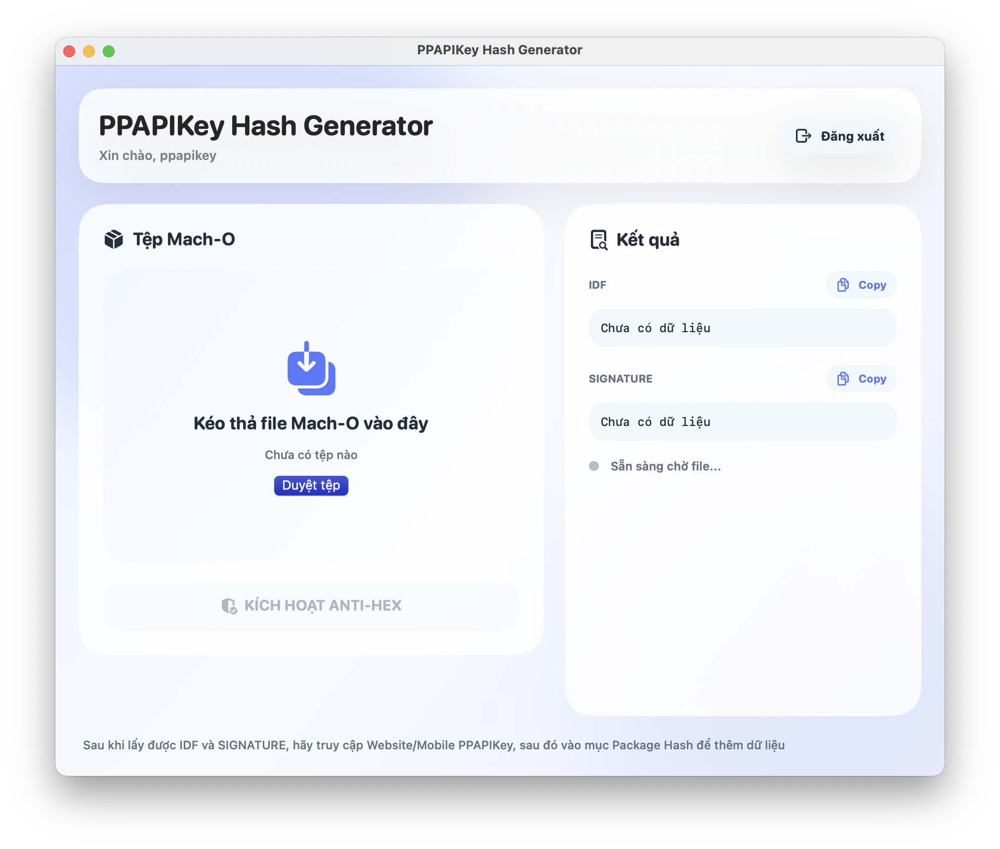 | 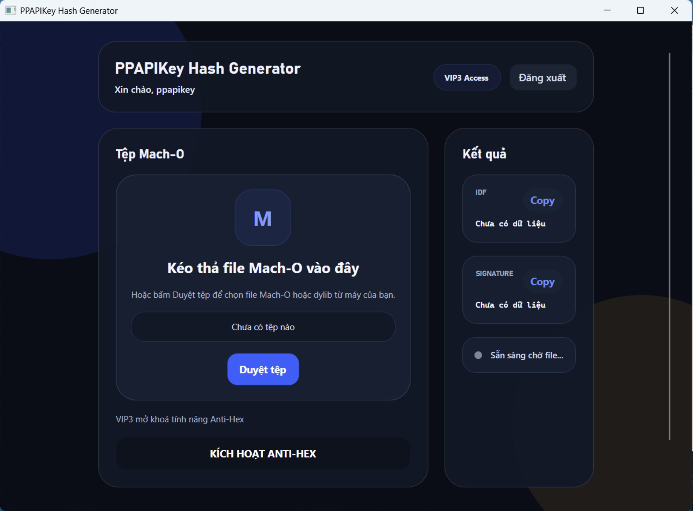 | 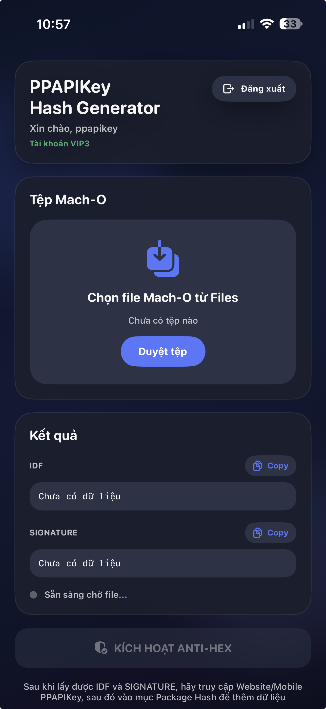 |

</div>

### Quy Trình (Flow)

- **VIP3 User:** Có thể Đưa `Dylib` vào Tool sau đó thực hiện **Anti-Hex Full**.
- **VIP2 User trở về:** Có thể Copy **IDF**, **Signature** sau đó truy cập `Dashboard -> Package Hash` và thêm Hash để **Anti-Hex Semi**.

---

## <a name="chủ-đề-vi"></a>Chủ Đề

Thư viện **Full** cung cấp **12 theme UI production**, cấu hình theo package cho HUD, nhập key, extension (UDID / update / skip) và toast.

<div align="center">

|                                          |                          |                                      |
| :--------------------------------------: | :----------------------: | :----------------------------------: |
|               **ANDROID**                |         **CST**          |              **GLASS**               |
|     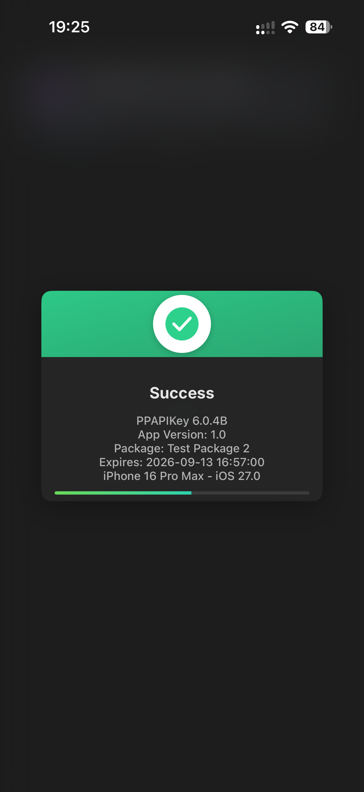     | 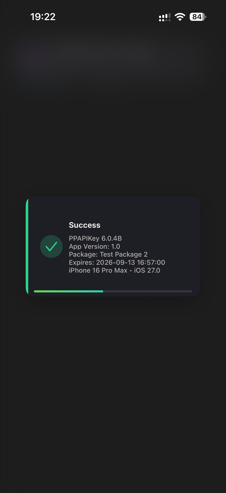 |     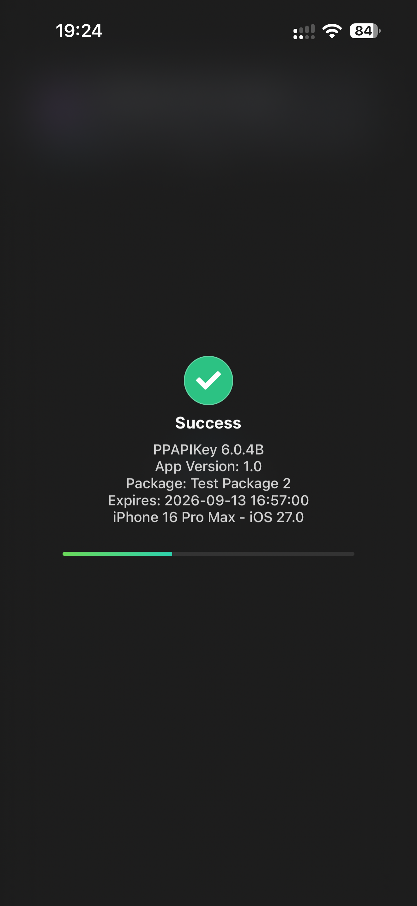     |
|                **HACKER**                |          **JG**          |              **LINUX**               |
|      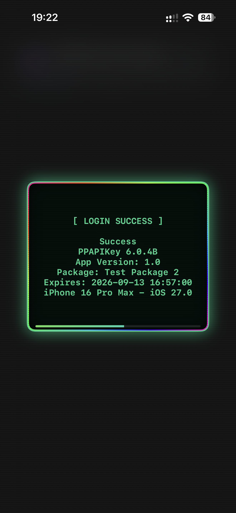      |  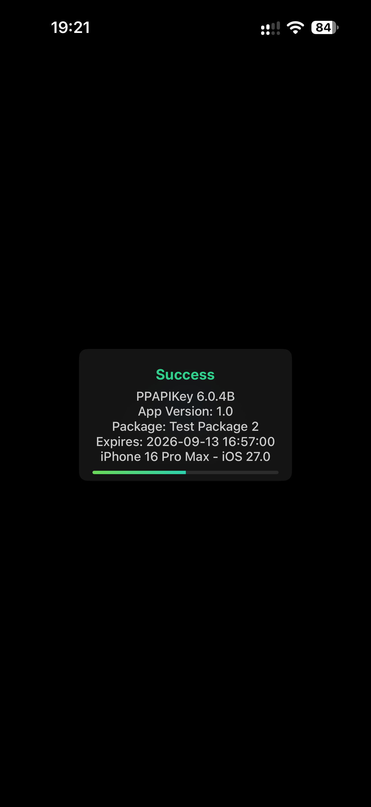  |     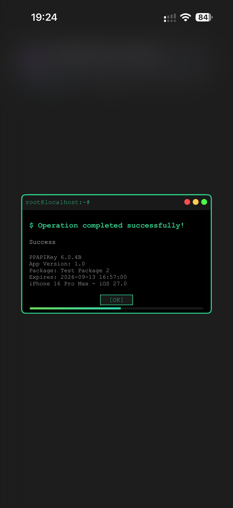     |
|                 **MAC**                  |         **MBP**          |            **MINECRAFT**             |
|         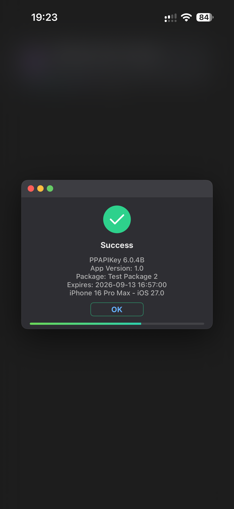         | 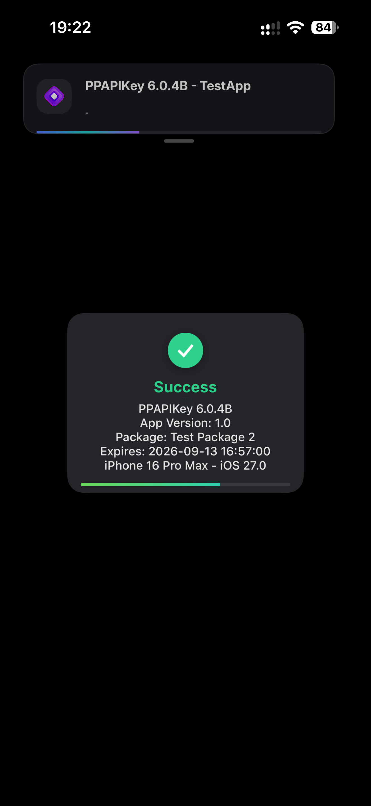 | 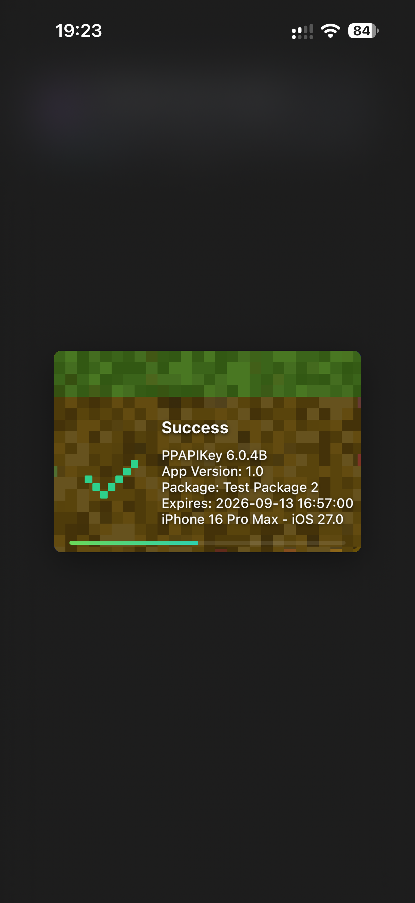 |
|             **NEWYEAR2026**              |         **SCL**          |                **XP**                |
| 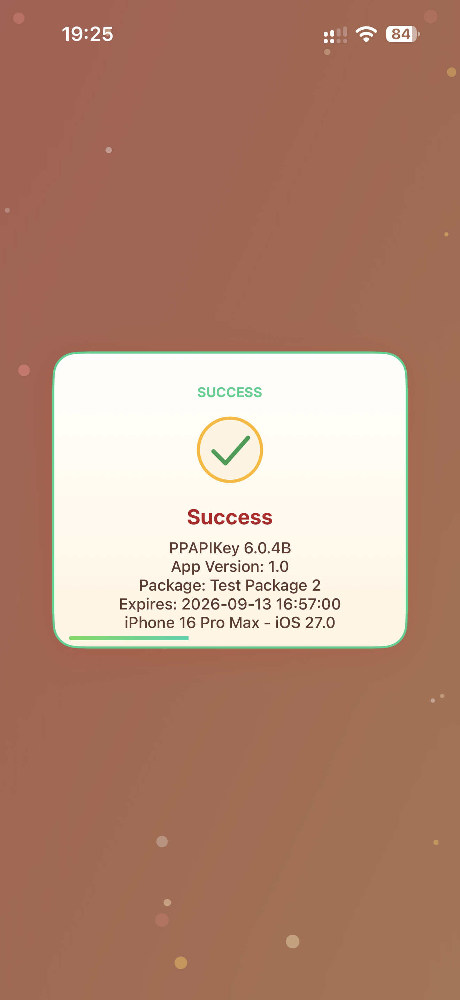 | 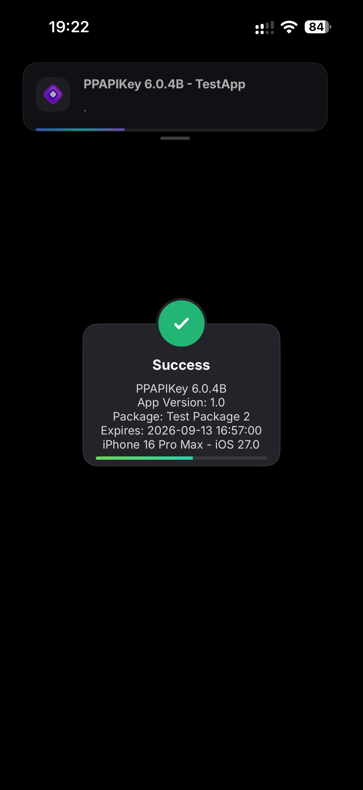 |        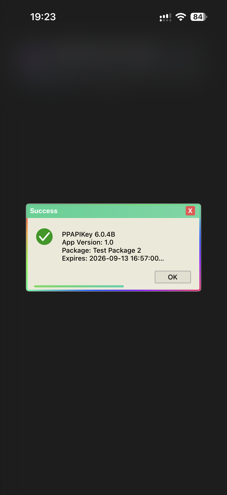        |

</div>

#### GLASS *(cập nhật 6.0.4)*

Trải nghiệm Liquid Glass trên blur fullscreen siêu mỏng. Nhập key, loading HUD, alert auto, Get UDID và modal update/skip hiển thị **trực tiếp trên nền app mờ** — không card đục.

| Thành phần | Hành vi |
| ---------- | ------- |
| Nhập key | Ô trong suốt · OK gradient tím · icon Font Awesome · countdown inline với moto (`moto - [giây]`) |
| Loading / Alert | Spinner/icon căn giữa · khoảng cách chữ ↔ thanh countdown cân đối · typography Light/Dark |
| Phản hồi | Haptic khi tương tác · không phát âm thanh enter-key / UDID |

---

## <a name="hỗ-trợ-vi"></a>Hỗ Trợ

| Kênh | Liên hệ |
| ---- | ------- |
| **Portal developer** | [v5.ppapikey.xyz](https://v5.ppapikey.xyz) |
| **Telegram** | [@pdp7803](https://t.me/pdp7803) |
| **Email** | duyphatpham783@gmail.com |

Cấu hình package, chọn theme và thiết lập Anti-Hex thực hiện trên dashboard portal.

---

## Giấy Phép & Bản Quyền

```
Copyright © 2024–2026 Phát Phạm (@pdp7803). All rights reserved.
```

### Khuyến nghị

1. **Không commit** package token vào git hoặc repo công khai.
2. **Gắn version thư viện** khi build production; test trên iOS mục tiêu trước khi phát hành.
3. **Cập nhật APIKey** thường xuyên để nhận bản vá bảo mật và sửa tương thích.

---

## <a name="lịch-sử-thay-đổi"></a>Lịch Sử Thay Đổi

<details open>
<summary><strong>v6.0.4</strong> — Tinh chỉnh Glass UI & chính sách âm thanh</summary>

**Build:** `PPAPIKey 6.0.4B` · `PPAPIKey 6.0.4F`

| Hạng mục | Thay đổi |
| -------- | -------- |
| **UI · Glass** | Blur fullscreen; layout trực tiếp trên nền; OK tím; FA icon; countdown moto; spacing loading/alert |
| **Âm thanh** | Gỡ `enterkey_showing`, `getudid_showing`; giữ haptic |
| **Tài liệu** | Một README chính thức |

</details>

<details>
<summary><strong>v6.0.3</strong> — Hệ thống UDID & enter-key PGAM</summary>

**Build:** `PPAPIKey 6.0.3B` · `PPAPIKey 6.0.3F`

> **Migration:** Hệ UDID/UUID thay đổi. Khuyến nghị **cài lại sạch** khi nâng cấp.

| Hạng mục | Thay đổi |
| -------- | -------- |
| **UI** | Giao diện Get UDID · theme nhập key **PGAM** |
| **Âm thanh** | Thêm âm thanh khi giao diện xuất hiện |
| **Bảo mật** | Lớp anti-crack |
| **Sửa lỗi** | Overlay che app khi cài `.tipa` · bỏ blur nền toàn cục |

</details>

<details>
<summary><strong>v6.0.2</strong> — Theme nhập key & hiệu năng</summary>

**Build:** `PPAPIKey 6.0.2B` · `PPAPIKey 6.0.2F`

- Làm lại giao diện nhập key và alert xác thực trên mọi theme
- Engine nhập key mới: **UIAL** và **GLASS**
- Sửa mã hóa gây CPU cao / nóng máy
- Sửa bug lấy UUID/UDID

</details>

<details>
<summary><strong>v6.0.1</strong> — Polish HUD theo theme</summary>

**Build:** `PPAPIKey 6.0.1B` · `PPAPIKey 6.0.1F`

- **CST** — Thanh accent khớp góc bo card
- **JG / MBP** — Vòng loading quanh logo
- **SCL** — HUD overlay tùy chỉnh; chuyển loading → alert mượt
- **Minecraft** — Dim từng pixel; panel chữ trong suốt
- **Glass** — Layout card HUD ban đầu

</details>

<details>
<summary><strong>v6.0.0</strong> — Viết lại lớn</summary>

- Kiến trúc tweak / core tách biệt · C Bridge API
- Đổi tên API: `shared`, `setToken:`, `getDeviceKey`, `getDeviceID`, …
- Thư viện kép (`basic` / `full`) · toast độc lập
- iOS tối thiểu **14.0** · **gnu++17**

</details>

---

## <a name="english-version"></a>English Version

### Table of Contents

| | |
|---|---|
| Getting started | [Overview](#overview) · [Requirements](#requirements) · [Installation](#installation) · [Configuration](#configuration) |
| Integration | [API Reference](#api-reference) · [C Bridge](#c-bridge-api) · [Examples](#usage-examples) · [Library Variants](#library-variants) |
| Product | [Release 6.0.4](#release-604) · [Themes](#themes) · [Anti-Hex](#anti-hex-app) · [Changelog](#changelog) |
| Support | [Contact](#support) · [License](#license--copyright) |

---

## <a name="release-604"></a>Release 6.0.4

> **Build identifiers:** `PPAPIKey 6.0.4B` (Basic) · `PPAPIKey 6.0.4F` (Full)
>
> **Upgrade notice:** A **clean reinstall is recommended** when upgrading to `6.0.4`, because this release uses a new Keychain and device-identity storage mechanism. Installing over an older version may retain legacy Keychain data and cause device-binding or key-state conflicts.

| Category | Summary |
| -------- | ------- |
| **Glass UI** | Full-screen ultra-thin blur; content renders directly on the app background — no opaque card. Enter Key uses a transparent field, purple OK button, Font Awesome icons, and inline countdown (`moto - [seconds]`). Improved spacing on loading and auto-alert HUDs. Light/Dark adaptive typography. |
| **Audio** | Removed enter-key and Get UDID appearance sounds. Haptic feedback retained. Loading and auto-alert audio unchanged. |
| **Documentation** | Consolidated release notes into this README; removed duplicate customer README. |

---

## Overview

**APIKey** is a production-ready authentication framework for iOS tweaks. It handles license validation, device binding, secure server communication, and a fully themed UI layer — so developers can focus on product logic instead of auth infrastructure.

Version **6.0** re-architected the stack: the tweak entry point and core library are fully decoupled and communicate only through the public header `PPAPIKey.h`. A **C Bridge** layer enables integration from pure C/C++ without importing Objective-C headers.

### Why APIKey 6.0

| Capability | Description |
| ---------- | ----------- |
| **Modular architecture** | Tweak (`tweak.mm`) and core library are independent; stable public API surface |
| **C Bridge** | `setTokenC`, `loadingC`, `packageData`, … for C/C++ codebases |
| **Dual library tiers** | `basic` (validation protection) and `full` (Anti-Hex + validation, VIP3) |
| **12 UI themes** | HUD, enter-key, UDID, update/skip flows — configurable per package |
| **Security** | Encrypted transport, anti-tamper, device fingerprinting |
| **Localization** | Built-in English and Vietnamese |

---

## What's New in 6.0

| 5.7 API            | 6.0 API                                   | Notes                                      |
| ------------------ | ----------------------------------------- | ------------------------------------------ |
| `sharedInstance`   | `shared`                                  | Shorter, cleaner singleton                 |
| `setPackageToken:` | `setToken:`                               | Simplified naming                          |
| `setENLanguage:`   | `setEN:`                                  | Simplified naming                          |
| `setAppVersion:`   | `setVer:`                                 | Simplified naming                          |
| `getKey`           | `getDeviceKey`                            | More explicit naming                       |
| `getUDID`          | `getDeviceID`                             | More explicit naming                       |
| —                  | **C Bridge** (`setTokenC`, `loadingC`, …) | New: call from pure C/C++                  |
| —                  | **Tweak Separation**                      | tweak.mm is independent from core          |
| —                  | **Dual Library**                          | `basic` (all users) and `full` (VIP3 only) |

**Removed from 6.0:** `showCSAL:`, `getDeviceName`, `getiOSVersion`, `getAppVersion`, `getAppName`, `getJailbreakStatus` — these are now handled at the tweak level or removed to keep the core lean.

---

## Features

| Module | Capability |
| ------ | ---------- |
| **Licensing** | Key validation, expiration control, quota tracking, clipboard copy |
| **Device** | UDID binding, device key, bundle ID, server-side package data |
| **Integration** | Objective-C API + C Bridge · decoupled tweak/core via `PPAPIKey.h` |
| **Distribution** | `libPPAPIKey_basic.a` (all tiers) · `libPPAPIKey_full.a` (VIP3, Anti-Hex) |
| **UX** | 12 themes · bilingual UI · toast · haptic feedback |

---

## Requirements

| Component        | Version           |
| ---------------- | ----------------- |
| **Platform**     | iOS 14.0+         |
| **Architecture** | arm64             |
| **Build System** | Theos             |
| **C++ Standard** | gnu++17           |
| **Language**     | Objective-C / C++ |

---

## Installation

> **Quick path:** Install Theos → download release artifacts → register on the [developer portal](https://v5.ppapikey.xyz) → link library in your `Makefile`.

### 1. Install Theos

Follow the official Theos installation guide for your platform:

```bash
# macOS
brew install theos

# Or visit: https://theos.dev/docs/installation
```

### 2. Download APIKey 6.0

Download the latest release from the [Release section](https://github.com/pp7803/APIKey/releases):

```
PPAPIKey.h
libPPAPIKey_full.a      # Full-featured library (VIP3 required)
libPPAPIKey_basic.a     # Lightweight variant (all users)
```

### 3. Account Registration

Create your developer account and obtain your package token:

🔗 **[Register at APIKey Portal](https://v5.ppapikey.xyz)**

---

## Configuration

### Project Setup

Add APIKey to your Theos project's `Makefile`:

```makefile
ARCHS = arm64
TARGET = iphone:clang:latest:14.0

TWEAK_NAME = YourTweak

$(TWEAK_NAME)_FRAMEWORKS = UIKit AVFoundation Foundation SystemConfiguration SafariServices AudioToolbox Accelerate

# Link APIKey library (choose one)
# $(TWEAK_NAME)_LDFLAGS += libPPAPIKey_full.a    # Full-featured (VIP3 required)
$(TWEAK_NAME)_LDFLAGS += libPPAPIKey_basic.a  # Lightweight (all users)

$(TWEAK_NAME)_CCFLAGS = -std=gnu++17 -Wno-deprecated-declarations -Wno-unused-variable
$(TWEAK_NAME)_FILES = tweak.mm

include $(THEOS_MAKE_PATH)/tweak.mk
```

---

## API Reference

### PPAPIKey Interface (Objective-C)

```objective-c
#import <Foundation/Foundation.h>

@interface PPAPIKey : NSObject

#pragma mark - Singleton
+ (instancetype)shared;

#pragma mark - Configuration
/**
 * Sets the package authentication token
 * @param token Your unique package token from APIKey portal
 */
- (void)setToken:(NSString *)token;

/**
 * Enables/disables English language mode
 * @param enable YES for English, NO for Vietnamese
 */
- (void)setEN:(BOOL)enable;

/**
 * Sets the application version
 * @param ver Version string (e.g., "1.0")
 */
- (void)setVer:(NSString *)ver;

#pragma mark - Core
/**
 * Initializes APIKey and executes completion block on success
 * @param execute Completion block called after successful initialization
 */
- (void)loading:(void (^)(void))execute;

/**
 * Packages device data for server submission
 * @param completion Block receiving the packaged data
 */
- (void)packageData:(void (^)(id data))completion;

#pragma mark - Information Retrieval
- (NSString *)getDeviceKey;      // Current license key
- (NSString *)getKeyExpire;      // Key expiration date
- (NSString *)getKeyAmount;      // Remaining key quota
- (NSString *)getDeviceID;       // Device UDID
- (NSString *)getAppBundle;      // Bundle identifier

#pragma mark - Key Management
- (void)exitKey;                 // Remove current license key
- (void)copyKey;                 // Copy license key to clipboard

@end
```

---

## C Bridge API

APIKey 6.0 exposes a pure C bridge, allowing integration from C/C++ code without importing Objective-C headers:

```c
// Set the package authentication token
extern void setTokenC(const char *token);

// Enable/disable English language mode (1 = English, 0 = Vietnamese)
extern void setENC(int enable);

// Set the application version
extern void setVerC(const char *ver);

// Initialize and execute completion block on success
extern void loadingC(void (^execute)(void));

// Package device data for server submission
extern void packageData(void (^completion)(id data));
```

> **Note:** `loadingC` and `packageData` use blocks, which require Objective-C block support (`-fblocks`). For pure C environments, use the Objective-C wrapper.

---

## Usage Examples

### Basic Implementation (Objective-C)

```objective-c
#import "YourTweak.h"
#import "PPAPIKey.h"

%hook YourClass

- (void)viewDidLoad {
    %orig;

    PPAPIKey *api = [PPAPIKey shared];

    [api setToken:@"your_package_token_here"];
    [api setVer:@"1.0"];
    [api setEN:YES];

    [api loading:^{
        NSLog(@"[APIKey] Initialized successfully");
        // Your code here — menu loading, feature activation, etc.
    }];
}

%end
```

### Basic Implementation (C Bridge)

```objective-c
// In your tweak.mm — no need to import PPAPIKey.h

extern "C" void setTokenC(const char *token);
extern "C" void setENC(int enable);
extern "C" void setVerC(const char *ver);
extern "C" void loadingC(void (^execute)(void));

static void run_api(void)
{
    setTokenC("your_package_token_here");
    setENC(0);       // 0 = Vietnamese
    setVerC("1.0");

    loadingC(^{
        NSLog(@"[APIKey] Initialized successfully");
    });
}
```

### Retrieve Device Information

```objective-c
PPAPIKey *api = [PPAPIKey shared];

NSString *key    = [api getDeviceKey];
NSString *expire = [api getKeyExpire];
NSString *amount = [api getKeyAmount];
NSString *udid   = [api getDeviceID];
NSString *bundle = [api getAppBundle];

NSLog(@"Key: %@, Expires: %@, Quota: %@", key, expire, amount);
NSLog(@"Device: %@, Bundle: %@", udid, bundle);
```

### Key Management

```objective-c
PPAPIKey *api = [PPAPIKey shared];

// Copy key to clipboard
[api copyKey];

// Remove key (logout)
[api exitKey];
```

### Full Tweak Template (tweak.mm)

```objective-c
#import <Foundation/Foundation.h>
#import <UIKit/UIKit.h>
#include <CoreFoundation/CoreFoundation.h>

#import "PPAPIKey.h"

extern "C" void setTokenC(const char *token);
extern "C" void setENC(int enable);
extern "C" void setVerC(const char *ver);
extern "C" void loadingC(void (^execute)(void));

// ---- Launch detection via CFNotificationCenter ----
static void launch_callback(CFNotificationCenterRef __unused c,
                            void *__unused o,
                            CFStringRef __unused n,
                            const void *__unused obj,
                            CFDictionaryRef __unused ui)
{
    dispatch_async(dispatch_get_main_queue(), ^{
        setTokenC("your_package_token_here");
        setENC(0);
        setVerC("1.0");
        loadingC(^{
            NSLog(@"[APIKey] Ready");
        });
    });
}

__attribute__((constructor))
static void tweak_init(void)
{
    CFNotificationCenterAddObserver(
        CFNotificationCenterGetLocalCenter(),
        NULL,
        launch_callback,
        (CFStringRef)UIApplicationDidFinishLaunchingNotification,
        NULL,
        CFNotificationSuspensionBehaviorDeliverImmediately
    );
}
```

---

## Library Variants

| Variant   | File                  | Description                                                                                        |
| --------- | --------------------- | -------------------------------------------------------------------------------------------------- |
| **Full**  | `libPPAPIKey_full.a`  | Anti-Hex Protected — protects dylib at generation + protects during key validation. **VIP3 only.** |
| **Basic** | `libPPAPIKey_basic.a` | Protects during key validation only. Lighter, available to all users.                              |

---

## Anti-Hex App

We provide a dedicated Anti-Hex application available on 3 platforms (macOS, Windows, iOS) to help you secure your tweak:

### Download

- [PPAPIKey Hash Generator (zip)](https://ppapikey.xyz/PPAPIkeyHashGenerator.zip) — includes `PPAPIKey Hash Generator.dmg`, `PPAPIKey Hash Generator.ipa`, `PPHashGenerator.Windows-win-x64.zip`

<div align="center">

|            macOS             |              Windows               |            iOS             |
| :--------------------------: | :--------------------------------: | :------------------------: |
|  |  |  |

</div>

### Workflow

- **VIP3 User:** Can input the `Dylib` into the Tool, then execute **Anti-Hex Full**.
- **VIP2 User (and below):** Can copy the **IDF** and **Signature** from the Tool, then access `Dashboard -> Package Hash` and add the Hash to execute **Anti-Hex Semi**.

---

## Themes

The **Full** library ships **12 production UI themes**, configurable per package for HUD, enter-key, extension (UDID / update / skip), and toast surfaces.

<div align="center">

|                                          |                          |                                      |
| :--------------------------------------: | :----------------------: | :----------------------------------: |
|               **ANDROID**                |         **CST**          |              **GLASS**               |
|          |  |          |
|                **HACKER**                |          **JG**          |              **LINUX**               |
|            |    |          |
|                 **MAC**                  |         **MBP**          |            **MINECRAFT**             |
|                  |  |  |
|             **NEWYEAR2026**              |         **SCL**          |                **XP**                |
|  |  |                |

</div>

#### GLASS *(updated in 6.0.4)*

Liquid Glass experience built on a full-screen ultra-thin blur. Enter Key, loading HUD, auto-alerts, Get UDID, and update/skip modals render **directly on the blurred app** — no opaque card chrome.

| Element | Behavior |
| ------- | -------- |
| Enter Key | Transparent input field · purple gradient OK · Font Awesome action icons · countdown inline with moto (`moto - [seconds]`) |
| Loading / Alert | Centered spinner or status icon · balanced text-to-countdown-bar spacing · Light/Dark adaptive typography |
| Feedback | Haptic on interaction · no enter-key / UDID appearance sound |

---

## Support

| Channel | Contact |
| ------- | ------- |
| **Developer portal** | [v5.ppapikey.xyz](https://v5.ppapikey.xyz) |
| **Telegram** | [@pdp7803](https://t.me/pdp7803) |
| **Email** | duyphatpham783@gmail.com |

For package configuration, theme selection, and Anti-Hex setup, use the dashboard on the developer portal.

---

## License & Copyright

```
Copyright © 2024–2026 Phat Pham (@pdp7803). All rights reserved.
```

### Best Practices

1. **Never commit** your package token to version control or public repositories.
2. **Pin library versions** in production builds and test on target iOS versions before release.
3. **Keep APIKey updated** to receive security patches and compatibility fixes.

---

## <a name="changelog"></a>Changelog

<details open>
<summary><strong>v6.0.4</strong> — Glass UI refinement & audio policy</summary>

**Build:** `PPAPIKey 6.0.4B` · `PPAPIKey 6.0.4F`

| Area | Changes |
| ---- | ------- |
| **UI · Glass** | Full-screen blur; direct-on-background layout; purple OK; FA icons; moto countdown; loading/alert spacing |
| **Audio** | Removed `enterkey_showing` and `getudid_showing`; haptic retained |
| **Docs** | Single canonical README |

</details>

<details>
<summary><strong>v6.0.3</strong> — UDID system & PGAM enter-key</summary>

**Build:** `PPAPIKey 6.0.3B` · `PPAPIKey 6.0.3F`

> **Migration:** UDID/UUID system changed. **Clean reinstall** recommended when upgrading from earlier builds.

| Area | Changes |
| ---- | ------- |
| **UI** | Dedicated Get UDID interface · **PGAM** enter-key theme |
| **Audio** | Interface appearance sounds added |
| **Security** | Anti-crack defense layer |
| **Fix** | Overlay covering app screen on `.tipa` install · removed global background blur |

</details>

<details>
<summary><strong>v6.0.2</strong> — Enter-key themes & performance</summary>

**Build:** `PPAPIKey 6.0.2B` · `PPAPIKey 6.0.2F`

- Redesigned enter-key and verification alerts across all themes
- New enter-key engines: **UIAL** (native alert) and **GLASS** (Liquid Glass)
- Fixed encryption-related CPU overheating
- UUID/UDID retrieval bug fixes

</details>

<details>
<summary><strong>v6.0.1</strong> — Per-theme HUD polish</summary>

**Build:** `PPAPIKey 6.0.1B` · `PPAPIKey 6.0.1F`

- **CST** — Accent bar respects card corner radius
- **JG / MBP** — Logo-centered loading ring animation
- **SCL** — Custom overlay HUD; seamless loading → alert transition
- **Minecraft** — Pixel dim only; transparent text panels
- **Glass** — Initial centered HUD card layout

</details>

<details>
<summary><strong>v6.0.0</strong> — Major rewrite</summary>

- Decoupled tweak / core architecture · C Bridge API
- API rename: `shared`, `setToken:`, `getDeviceKey`, `getDeviceID`, …
- Dual library (`basic` / `full`) · independent toast system
- Minimum iOS **14.0** · **gnu++17**

</details>

---

---

<div align="center">

<br>

**APIKey** · License Authentication Framework for iOS

Developed by [Phat Pham](https://t.me/pdp7803) · [Portal](https://v5.ppapikey.xyz) · [Releases](https://github.com/pp7803/APIKey/releases)

**[↑ Back to top](#apikey-60)**

</div>
