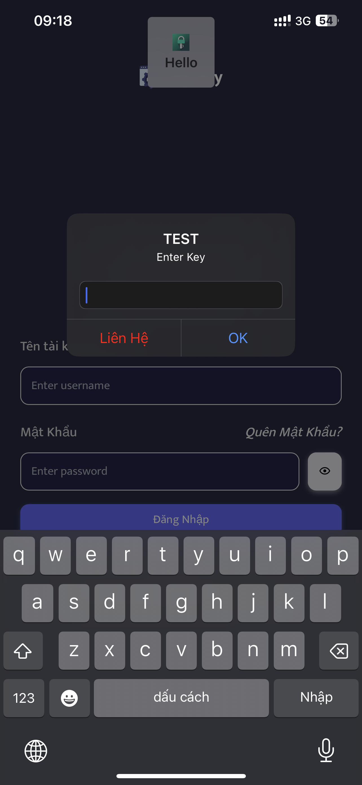
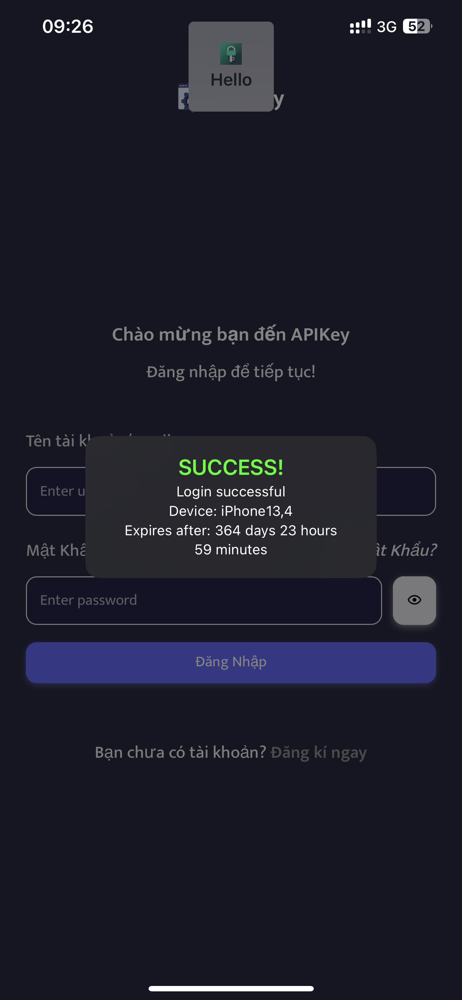
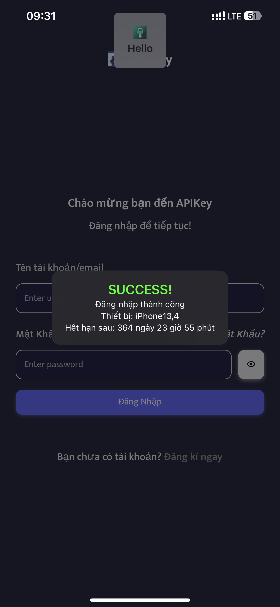
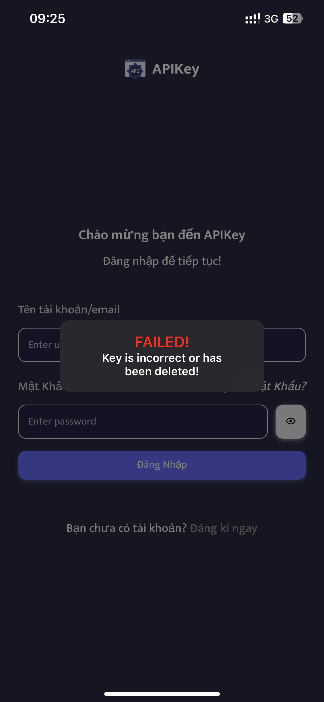
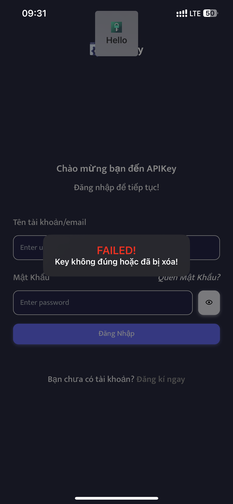
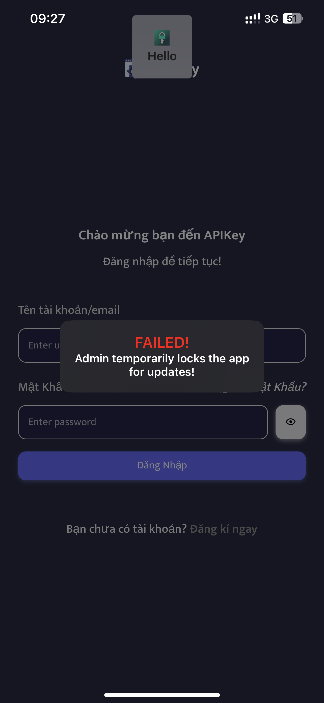

# APIKey - Quản Lí Khách Hàng - v5.1.1
<p align="center">
  <font size="4">
    <b>Cách Dùng</b>
  </font>
</p>
<div style="background-color: #; color: #ffffff; padding: 10px; border-radius: 5px;">
<pre>

## Cài đặt
Tải về Folder .zip của APIKey tại mục Release
## Server
Đăng kí tài khoản, tạo package tại [APIKey](https://v2.ppapikey.xyz)
Link Cài đặt cấu hình [APIKey](https://raw.githubusercontent.com/pp7803/APIKey/main/AppConfig/ppapikey.mobileconfig)
## APIKey Method
```Objective-C
- (void) loading:(void (^)(void))execute;
- (void) setPackageToken:(NSString*) token;
- (void) setOKText:(NSString *) oktext;
- (void) setContactText:(NSString *) contacttext;
- (void) setENLanguage:(BOOL) value;
- (void) exitKey;      //Call this function to Clear key
- (void) showBundle;   //Call this function to Show App Bundle id
- (void) copyKey;      //Call this function to Copy key to clipboard

- (NSString*) tb64:(NSString *) text;//decrypt base64
- (NSString*) getKey;
- (NSString*) getTimeKey;
- (NSString*) getUDID;
- (NSString*) getDeviceName;
- (NSString*) getiOSVersion;
- (NSString*) getAppVersion;
- (NSString*) checkJailbreak;

```
## Example
```Objective-C
    PPAPIKey *APIKey = [[PPAPIKey alloc] init];
    [APIKey setPackageToken:NSSENCRYPT("")]; 
    [APIKey setOKText:NSSENCRYPT("OK")];
    [APIKey setContactText:NSSENCRYPT("Liên Hệ")];
    [APIKey setENLanguage:NO];
    [APIKey loading:^{
        //loadmenu()
    }];

```
## Tại Makefile của dự án Theos
```Objective-C
    $(TWEAK_NAME)_LDFLAGS+= libAPIKey.a
```
</pre>
<p align="center">
  <font size="6">
    <b>AUTH ALERT</b>
  </font>
</p>

<p align="center">
    
</p>
</div>
<p align="center">
  <font size="6">
    <b>AUTH IMAGES</b>
  </font>
</p>

<p align="center"><b>Login Success!</b></p> 

<table style="width:100%">
    <tr>
        <td align="center">
            <figure>
                
                <figcaption>EN</figcaption>
            </figure>
        </td>
        <td align="center">
            <figure>
                
                <figcaption>VI</figcaption>
            </figure>
        </td>
    </tr>
</table>

<p align="center"><b>Incorrect Key!</b></p>

<table style="width:100%">
  <tr>
    <td align="center">
      <figure>
        
        <figcaption>EN</figcaption>
      </figure>
    </td>
    <td align="center">
      <figure>
        
        <figcaption>VI</figcaption>
      </figure>
    </td>
  </tr>
</table>

<p align="center"><b>Lock Device!</b></p>

<table style="width:100%">
  <tr>
    <td align="center">
      <figure>
        
        <figcaption>EN</figcaption>
      </figure>
    </td>
    <td align="center">
      <figure>
        
        <figcaption>VI</figcaption>
      </figure>
    </td>
  </tr>
</table>

<p align="center"><b>Lock Package</b></p>

<table style="width:100%">
  <tr>
    <td align="center">
      <figure>
        
        <figcaption>EN</figcaption>
      </figure>
    </td>
    <td align="center">
      <figure>
        
        <figcaption>VI</figcaption>
      </figure>
    </td>
  </tr>
</table>
##Tác Giả

Tạo bởi [Phát Phạm](https://t.me/pdp7803).
