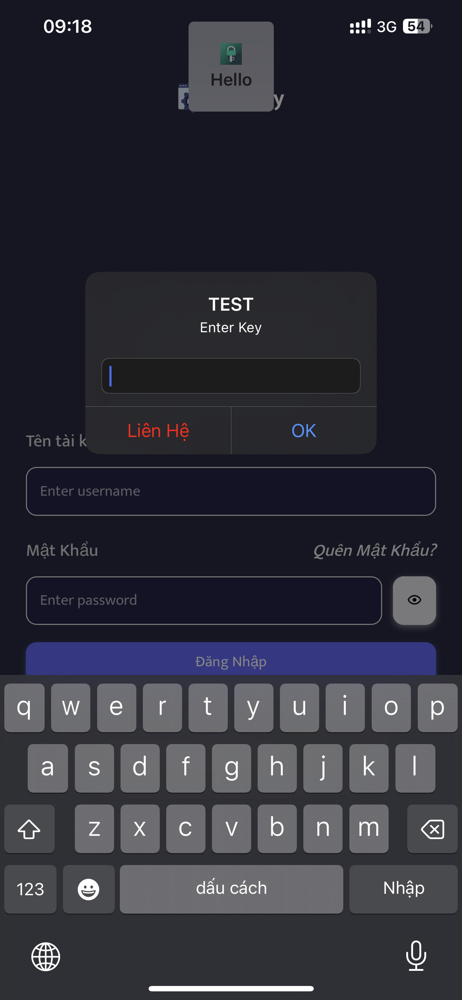
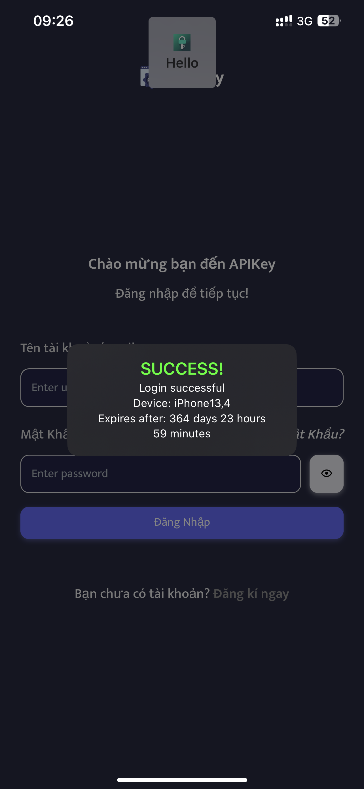
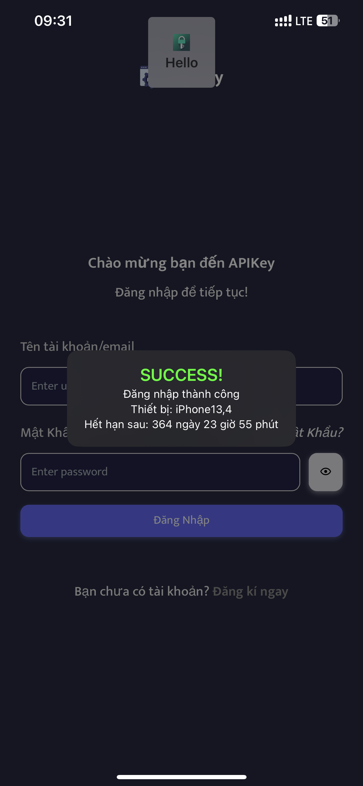
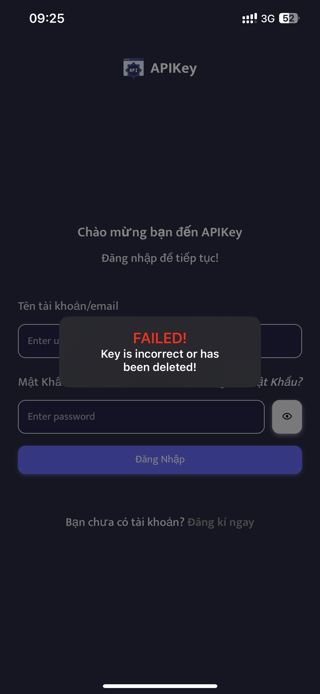
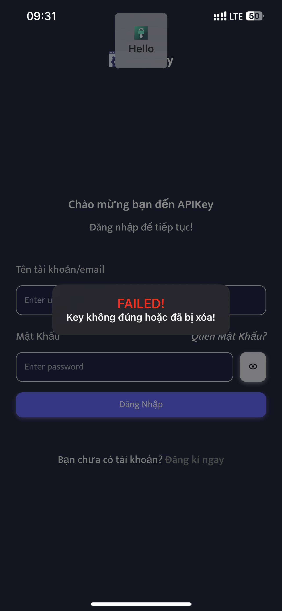
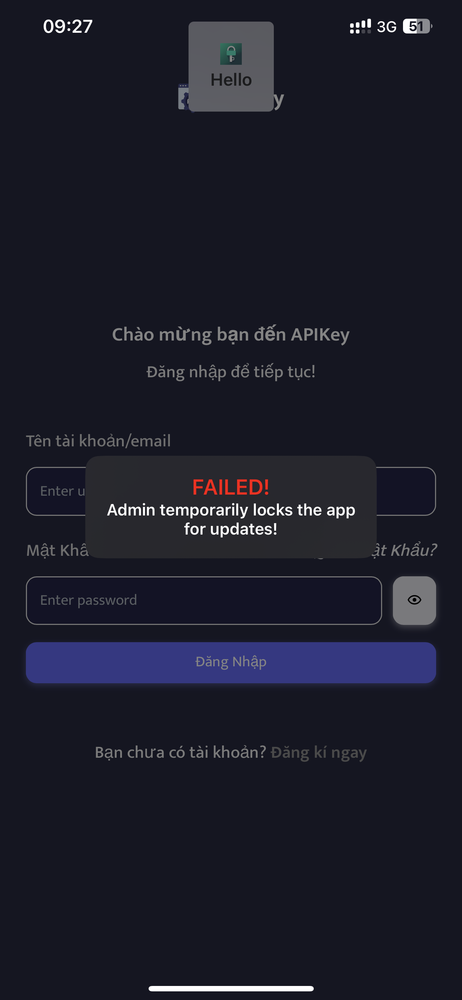

  
    <b>USAGE</b>
  

<pre>
    PPAPIKey *apikey = [[PPAPIKey alloc] init];
    [apikey setToken:NSSENCRYPT("token")]; 
    [apikey setSubmitContent:NSSENCRYPT("OK")];
    [apikey setContactContent:NSSENCRYPT("Liên Hệ")];
    [apikey setEnLanguage:NO]; //Change to YES if you want to use English Version
    [apikey setRealUDID:YES]; //Change to YES if you want to use Real UDID
    [apikey paid:^{
       //loadmenu()
    }];

</pre>

<b>Auth Alert!</b>
 

    

  
    <b>AUTH IMAGES</b>
  

<b>Login Success!</b>
 

<table style="width:100%">
    <tr>
        <td align="center">
            <figure>
                
                <figcaption>EN</figcaption>
            </figure>
        </td>
        <td align="center">
            <figure>
                
                <figcaption>VI</figcaption>
            </figure>
        </td>
    </tr>
</table>

<b>Incorrect Key!</b>

<table style="width:100%">
  <tr>
    <td align="center">
      <figure>
        
        <figcaption>EN</figcaption>
      </figure>
    </td>
    <td align="center">
      <figure>
        
        <figcaption>VI</figcaption>
      </figure>
    </td>
  </tr>
</table>

<b>Lock Device!</b>

<table style="width:100%">
  <tr>
    <td align="center">
      <figure>
        
        <figcaption>EN</figcaption>
      </figure>
    </td>
    <td align="center">
      <figure>
        
        <figcaption>VI</figcaption>
      </figure>
    </td>
  </tr>
</table>

<b>Lock Package</b>

<table style="width:100%">
  <tr>
    <td align="center">
      <figure>
        
        <figcaption>EN</figcaption>
      </figure>
    </td>
    <td align="center">
      <figure>
        
        <figcaption>VI</figcaption>
      </figure>
    </td>
  </tr>
</table>
